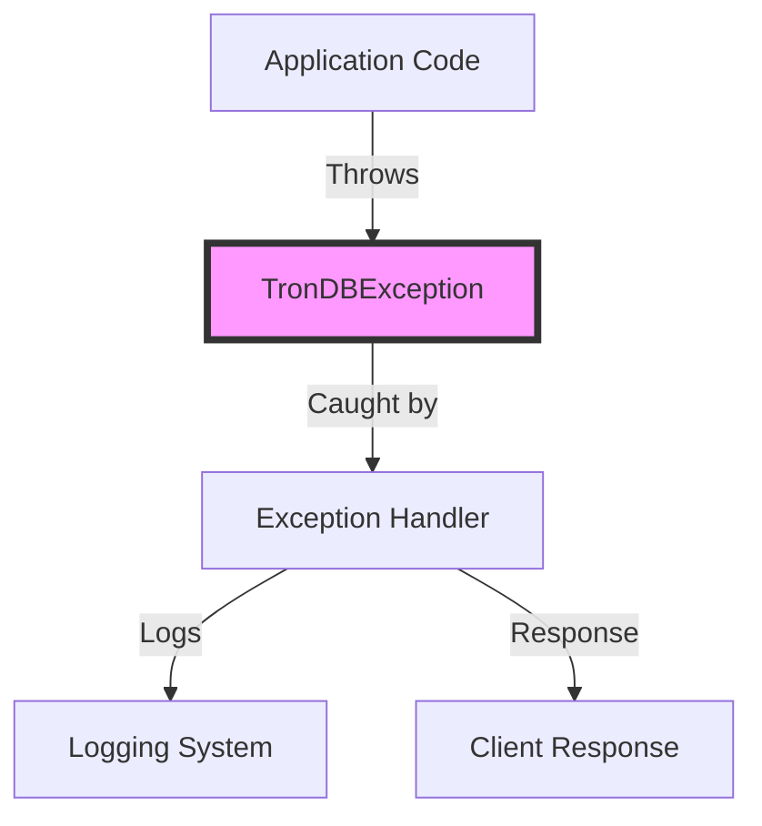

## Module: TronDBException.java
- **模块名称**：TronDBException.java

- **主要目标**：该模块的目的是定义一个专门用于处理Tron数据库操作中可能出现的异常情况的异常类。它扩展了Java的`RuntimeException`，使得使用该异常类可以在运行时捕获数据库操作中的错误，并允许开发者进行相应的错误处理。

- **关键功能**：
  - `TronDBException()`：无参数构造函数，创建一个基本的异常实例。
  - `TronDBException(String s)`：接受一个字符串参数的构造函数，用于创建包含错误消息的异常实例。
  - `TronDBException(String s, Throwable throwable)`：接受一个字符串和一个`Throwable`作为参数的构造函数，用于创建包含错误消息和一个原始异常的异常实例。
  - `TronDBException(Throwable throwable)`：接受一个`Throwable`作为参数的构造函数，用于创建一个基于原始异常的异常实例。

- **关键变量**：无直接变量，但构造函数的参数（字符串消息和`Throwable`对象）是关键的，因为它们提供了异常的详细信息。

- **相互依赖性**：该模块依赖于Java的异常处理机制，特别是它扩展了`RuntimeException`类。它可能与系统中负责数据库操作的其他模块相互作用，尤其是在处理数据库操作失败时。

- **核心与辅助操作**：所有构造函数都是核心操作，因为它们直接支持创建异常实例的能力。没有明显的辅助操作。

- **操作序列**：通常，当数据库操作失败时，会创建一个`TronDBException`实例，可能包含错误消息和/或原始异常，然后抛出该异常以供调用者捕获和处理。

- **性能方面**：异常处理通常与性能考虑相关，因为异常的创建和抛出可能是资源密集型的。然而，`TronDBException`作为一个主要用于错误处理的类，其性能影响通常被视为管理错误状态的必要开销。

- **可重用性**：由于`TronDBException`是一个相对通用的异常类，它可以在不同的数据库操作场景中重用，特别是在处理与Tron数据库相关的操作时。

- **使用**：在Tron数据库操作中，当遇到异常情况（如连接失败、查询错误等）时，可以抛出`TronDBException`，并可选地包含错误消息和/或原始异常，以提供更多的上下文信息。

- **假设**：该模块假设开发者熟悉Java的异常处理机制，并且理解如何有效地使用异常来处理运行时错误。此外，还假设在Tron数据库操作中可能遇到的错误需要特定的异常类型来表示。
## Flow Diagram [via mermaid]

