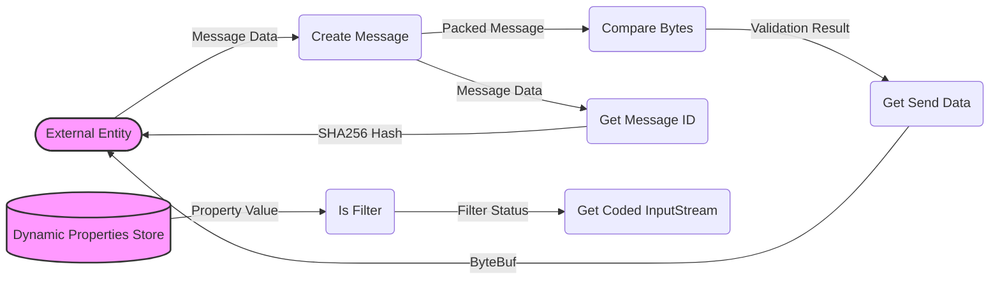

## Module: Message.java
- **模块名称**：Message.java

- **主要目标**：定义一个抽象的消息类，用于在网络层之间传递消息，支持数据打包、消息类型定义、消息ID生成等功能。

- **关键功能**：
  - `compareBytes(byte[] src, byte[] dest)`: 比较两个字节数组是否相等，用于校验数据完整性。
  - `getCodedInputStream(byte[] data)`: 根据字节数组数据获取`CodedInputStream`实例，支持过滤未知字段。
  - `getSendData()`: 获取发送数据的`ByteBuf`格式。
  - `getSendBytes()`: 获取发送数据的字节数组格式。
  - `getMessageId()`: 生成消息的ID，用于消息追踪和识别。
  - `getData()`: 获取消息的数据内容。
  - `getType()`: 获取消息的类型。
  - `getAnswerMessage()`: 抽象方法，定义了获取响应消息类的类型。

- **关键变量**：
  - `data`: 消息的数据内容。
  - `type`: 消息的类型标识。

- **依赖关系**：
  - 与`DynamicPropertiesStore`有依赖关系，用于获取配置信息，如是否启用协议过滤。
  - 与`MessageTypes`枚举类有依赖关系，用于定义和识别消息类型。

- **核心 vs. 辅助操作**：
  - 核心操作：消息的封装、类型识别、ID生成。
  - 辅助操作：数据完整性校验、未知字段过滤配置。

- **操作顺序**：构造消息 -> 设置数据和类型 -> 在需要时进行数据完整性校验 -> 根据需求获取发送数据或消息ID。

- **性能方面**：
  - 需要注意的是数据完整性校验和未知字段过滤可能会对性能产生一定影响。
  - 使用字节数组和反射可能会增加处理时间。

- **可重用性**：
  - 作为抽象类，`Message`提供了基础框架和通用功能，易于扩展和重用以实现具体的消息类型。

- **使用**：
  - 该类被设计为网络通信中消息传递的基础，可以被继承和实现以支持不同类型的消息传递需求。

- **假设**：
  - 假设所有传入的数据都是有效且格式正确的。
  - 假设系统配置（如`DynamicPropertiesStore`中的配置）是预先设定好的。

通过以上分析，可以看出`Message.java`模块是为了在分布式或网络应用程序中实现高效、灵活的消息传递而设计的。它通过提供一系列的方法和变量，支持消息的封装、发送和接收，同时允许通过继承该抽象类来创建具体的消息类型，以满足不同的应用场景需求。
## Flow Diagram [via mermaid]

