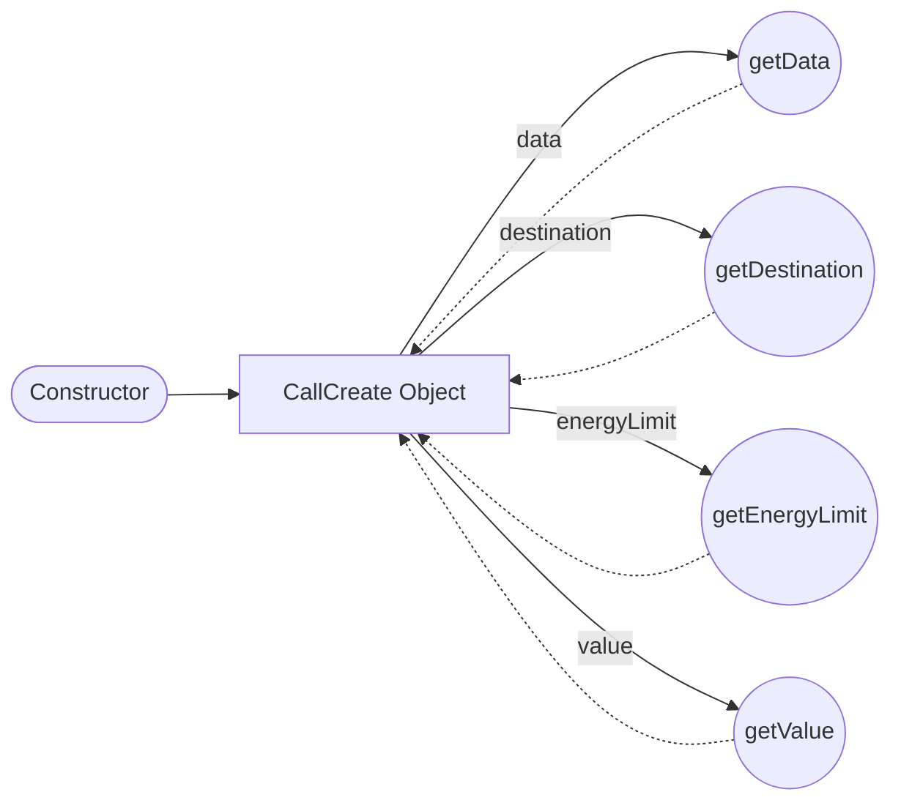

## Module: CallCreate.java
- **模块名称**：CallCreate.java

- **主要目标**：该模块的目的是为了创建一个表示区块链上的调用或合约创建操作的数据结构。它封装了与这些操作相关的所有必要信息，如目标地址、传输数据、能量限制和价值。

- **关键函数**：
  - `public CallCreate(byte[] data, byte[] destination, byte[] energyLimit, byte[] value)`：构造函数，初始化一个调用或创建操作的实例。
  - `public byte[] getData()`：返回与调用或创建操作相关的数据。
  - `public byte[] getDestination()`：返回目标地址。
  - `public byte[] getEnergyLimit()`：返回操作的能量限制。
  - `public byte[] getValue()`：返回传输的价值。

- **关键变量**：
  - `private final byte[] data`：关联的数据。
  - `private final byte[] destination`：目标地址。
  - `private final byte[] energyLimit`：能量限制。
  - `private final byte[] value`：价值。

- **互依性**：该模块可能与区块链的其他部分，如交易处理和合约执行机制，有强烈的互依性，但在提供的代码段中没有直接体现出来。

- **核心与辅助操作**：构造函数和获取方法是核心操作，因为它们直接支持创建和访问调用/创建操作的关键信息。没有明显的辅助操作。

- **操作序列**：首先通过构造函数初始化一个`CallCreate`实例，随后可以通过各种getter方法访问实例的具体信息。

- **性能方面**：性能考虑可能包括构造函数和方法的执行效率，尤其是在处理大量的调用/创建操作时。内存使用效率也是一个考虑因素。

- **可重用性**：该模块设计为一个简单且专一的数据结构，因此具有很高的可重用性，可以轻松集成到需要处理区块链调用或创建操作的任何系统中。

- **使用**：在区块链系统中，当需要创建一个新的合约调用或合约创建操作时，可以使用此模块。它为这些操作提供了一个标准化的表示方式。

- **假设**：代码的编写基于几个假设，包括但不限于：
  - 区块链操作需要数据、目标地址、能量限制和价值这些基本信息。
  - 用户或系统知道如何正确生成和使用这些信息。
  - 系统环境能够支持Java代码的执行。
## Flow Diagram [via mermaid]

