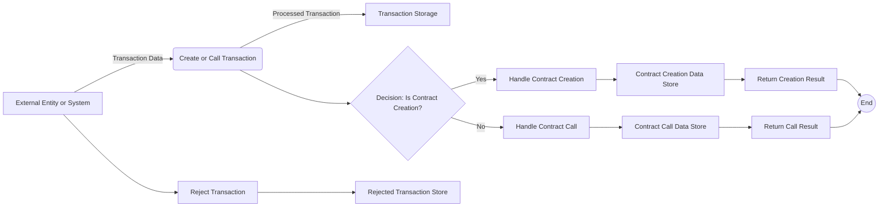

## Module: InternalTransaction.java
- **模块名称**：InternalTransaction.java
- **主要目标**：该模块的目的是定义和处理以太坊J库中的内部交易，包括创建和调用智能合约。
- **关键功能**：
  - 构造函数：初始化内部交易，包括根交易和子交易。
  - `getTransaction`：获取交易信息。
  - `setTransaction`：设置交易信息。
  - `reject`：标记交易为拒绝。
  - `isRejected`：检查交易是否被拒绝。
  - `getHash`：获取交易的哈希值。
  - `getEncoded`：获取编码后的交易信息。
- **关键变量**：
  - `transaction`：交易数据。
  - `hash`：交易的哈希值。
  - `parentHash`：父交易的哈希值。
  - `value`：转移的TRX数量（以sun计算）。
  - `receiveAddress`：接收地址。
  - `sendAddress`：发送地址。
  - `data`：消息调用的输入数据或新合约的初始化代码。
  - `tokenInfo`：代币信息。
- **交互依赖**：
  - 与`TransactionCapsule`和`ContractCapsule`模块交互，用于处理交易和合约数据。
  - 使用`WalletUtil`生成合约地址。
- **核心与辅助操作**：
  - 核心操作包括交易的创建、数据的编码和哈希值的生成。
  - 辅助操作包括交易的拒绝标记和获取额外数据。
- **操作序列**：
  - 首先，根据交易类型（创建合约或调用合约）初始化内部交易。
  - 然后，根据需要设置交易数据和状态。
  - 最后，生成交易的哈希值和编码数据。
- **性能方面**：
  - 性能考虑主要集中在数据的编码和哈希计算上，需要优化以减少处理时间。
- **可重用性**：
  - 该模块设计为可重用，可以在处理不同交易和合约调用时复用。
- **使用**：
  - 用于以太坊J库中的智能合约创建和调用，以及交易的内部处理。
- **假设**：
  - 假设所有传入的交易和合约数据都是有效和正确的。
  - 假设在交易创建或调用过程中不会发生异常情况。
## Flow Diagram [via mermaid]

