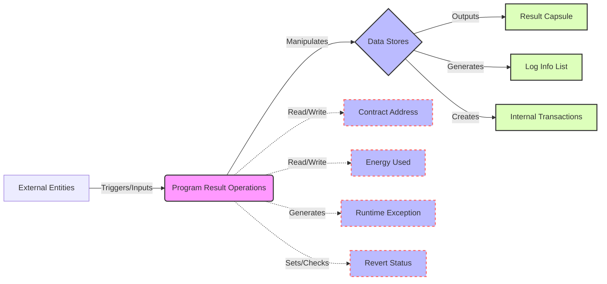

## Module: ProgramResult.java
根据提供的代码模块，以下是用中文进行的综合分析：

- **模块名称**：ProgramResult.java
- **主要目标**：该模块的目的是为了处理和存储智能合约执行的结果，包括使用的能量、执行结果、日志信息等。
- **关键功能**：
  - `spendEnergy` 和 `spendEnergyWithPenalty`：计算执行智能合约过程中消耗的能量。
  - `setRevert` 和 `isRevert`：设置和检查智能合约是否被回滚。
  - `addDeleteAccount` 和 `getDeleteAccounts`：处理和存储在执行过程中需要删除的账户。
  - `addLogInfo` 和 `getLogInfoList`：添加和获取执行过程中产生的日志信息。
  - `addInternalTransaction` 和 `getInternalTransactions`：添加和获取内部交易列表。
  - `merge`：合并另一个`ProgramResult`的结果到当前实例。
- **关键变量**：
  - `energyUsed`：用于记录执行智能合约过程中消耗的能量。
  - `hReturn`：存储智能合约执行后返回的数据。
  - `contractAddress`：智能合约地址。
  - `logInfoList`：执行过程中产生的日志信息列表。
  - `internalTransactions`：内部交易列表。
- **互相依赖**：该模块与系统中的智能合约执行、交易处理、日志记录等其他组件有交互。
- **核心与辅助操作**：
  - 核心操作包括能量消耗计算、智能合约执行结果处理。
  - 辅助操作包括日志信息和内部交易的处理。
- **操作序列**：首先初始化，执行智能合约时记录能量消耗和内部状态变化，执行完毕后合并结果。
- **性能方面**：关注点主要是能量计算的效率和内部状态管理的优化。
- **可重用性**：该模块设计成可重用，可以在不同的智能合约执行场景下使用。
- **使用**：在智能合约执行引擎中使用，用于记录和处理执行结果。
- **假设**：假设智能合约执行过程中的能量消耗、状态变化等都可以通过此模块准确记录和处理。

这个分析基于提供的代码片段，旨在概述`ProgramResult.java`模块的设计和功能。
## Flow Diagram [via mermaid]

