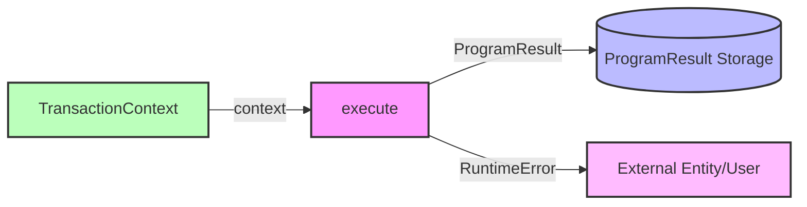

## Module: Runtime.java
**模块名称**：Runtime.java

**主要目的**：该模块定义了一个处理交易执行和智能合约执行的接口。其目的是为了提供一个统一的执行环境，处理与交易执行相关的逻辑，包括合约验证和执行异常。

**关键功能**：
- `execute(TransactionContext context)`：这个方法负责执行交易，它接收一个`TransactionContext`对象作为参数，可能抛出`ContractValidateException`或`ContractExeException`异常，表示合约验证或执行时的错误。
- `getResult()`：此方法返回一个`ProgramResult`对象，包含执行结果的详细信息，如状态、消耗的能量等。
- `getRuntimeError()`：如果在执行过程中发生错误，此方法可以获取到具体的错误信息字符串。

**关键变量**：虽然直接在接口中没有定义变量，但通过方法参数和返回类型，可以推断出`TransactionContext`和`ProgramResult`是该模块中处理的关键数据结构。

**相互依赖性**：该模块依赖于`org.tron.core.db.TransactionContext`来获取交易上下文信息，同时依赖于`org.tron.core.exception`中定义的异常类来处理合约验证和执行过程中可能出现的异常情况。

**核心与辅助操作**：`execute`方法是核心操作，负责实际的交易执行逻辑。`getResult`和`getRuntimeError`可以视为辅助操作，用于获取执行结果和错误信息。

**操作序列**：通常，首先会调用`execute`方法执行交易，执行过程中可能会抛出异常。执行完成后，可以通过`getResult`获取执行结果，如果需要错误信息，可以调用`getRuntimeError`。

**性能方面**：执行效率和资源消耗（如计算能量消耗）是性能考虑的重点。异常处理机制也可能对性能有一定影响。

**可重用性**：作为一个接口，`Runtime`定义了一套标准的执行环境，可以被不同的实现所复用，以适应不同的执行逻辑需求。

**使用情况**：该接口被实现用于处理交易和智能合约的执行。具体的实现类会根据`org.tron`区块链平台的需要来执行相应的逻辑。

**假设**：在设计此接口时，假设了交易执行环境是可预测和标准化的，异常情况可以通过定义的异常类来处理。同时，假设存在一个能够提供必要信息和执行结果反馈的标准环境。

通过上述分析，我们可以看到`Runtime`接口在`org.tron`区块链平台中扮演着核心的角色，定义了交易和智能合约执行的标准流程和接口，为高效和标准化的交易执行提供了基础。
## Flow Diagram [via mermaid]

