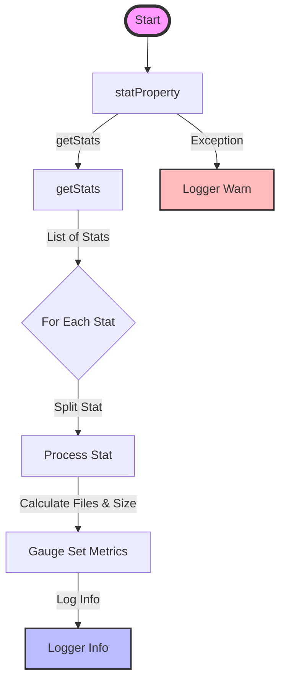

## Module: DbStat.java
- **模块名称**：DbStat.java

- **主要目标**：该模块的目的是为了监控和统计数据库状态，包括文件数量和数据库大小等信息。

- **关键功能**：
  - `statProperty()`：该方法负责收集数据库统计信息，并通过Prometheus指标进行记录。
  - `getStats()`：抽象方法，要求子类实现，用于获取数据库的统计信息。
  - `getEngine()`：抽象方法，要求子类实现，用于获取数据库引擎名称。
  - `getName()`：抽象方法，要求子类实现，用于获取数据库的名称。

- **关键变量**：
  - `logger`：用于记录日志信息。
  - `Metrics.gaugeSet`：用于设置Prometheus指标的方法。

- **相互依赖性**：该模块依赖于`org.tron.common.prometheus.Metrics`类来设置和管理Prometheus指标，同时也依赖于子类实现的具体数据库统计信息获取方法。

- **核心与辅助操作**：
  - 核心操作：收集数据库的统计信息，并通过Prometheus进行记录。
  - 辅助操作：日志记录。

- **操作序列**：首先调用`statProperty()`方法，该方法内部会调用`getStats()`获取数据库统计信息，然后解析这些信息，并通过`Metrics.gaugeSet`设置相应的Prometheus指标。

- **性能方面**：需要注意的性能考虑包括统计信息收集的效率以及对数据库性能的影响。

- **可重用性**：该模块设计为抽象类，通过抽象方法的方式要求子类实现具体的数据库统计信息获取，这种设计提高了模块的可重用性，可以适应不同的数据库引擎。

- **使用方法**：要使用该模块，需要创建一个继承自`DbStat`的子类，并实现`getStats()`、`getEngine()`和`getName()`这三个抽象方法。

- **假设**：该模块假设所有的数据库都能提供一致格式的统计信息，以及Prometheus服务是可用的。
## Flow Diagram [via mermaid]

