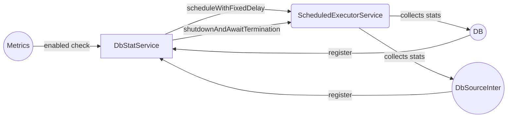

## Module: DbStatService.java
**模块名称**：DbStatService.java

**主要目标**：该模块的目的是定期收集数据库的统计信息，并且在启用了指标（Metrics）的情况下，按照预定的时间间隔执行统计任务。

**关键函数**：
- `register(DB<byte[], byte[]> db)`: 用于注册需要进行统计的数据库实例。如果指标（Metrics）被启用，它会安排数据库统计任务以固定延迟执行。
- `register(DbSourceInter<byte[]> db)`: 这是一个重载的方法，用于注册另一种类型的数据库实例进行统计。
- `shutdown()`: 用于关闭统计执行器，如果指标（Metrics）被启用，它会等待当前任务完成后关闭执行器。

**关键变量**：
- `esName`: 用于标识执行统计任务的执行器服务名称。
- `statExecutor`: 一个计划执行服务，用于安排和执行数据库统计任务。

**相互依赖性**：
- 依赖于`ExecutorServiceManager`来创建和管理执行服务。
- 依赖于`Metrics`来判断是否启用了指标收集功能。
- 与`DB`和`DbSourceInter`接口交互，用于实际执行统计操作。

**核心与辅助操作**：
- 核心操作包括注册数据库实例并定期执行统计任务。
- 辅助操作包括执行器的创建和关闭。

**操作序列**：
1. 创建单线程计划执行服务。
2. 通过`register`方法注册数据库实例。
3. 如果指标被启用，以固定延迟执行统计任务。
4. 通过`shutdown`方法关闭执行服务。

**性能方面**：
- 使用单线程执行器限制了并发执行，保证了统计任务的顺序执行，减少了对数据库的并发压力。
- 固定延迟的执行策略有助于平衡统计任务对系统资源的占用。

**可重用性**：
- 该模块设计为通用的数据库统计服务，可以通过注册不同的数据库实例来重用。

**使用**：
- 在需要收集数据库统计信息的系统中，通过调用`register`方法注册数据库实例，然后根据需要调用`shutdown`来优雅地关闭服务。

**假设**：
- 假设`Metrics.enabled()`能够正确反映系统是否启用了指标收集功能。
- 假设所有注册的数据库实例都实现了`stat`方法，用于执行统计任务。
## Flow Diagram [via mermaid]

