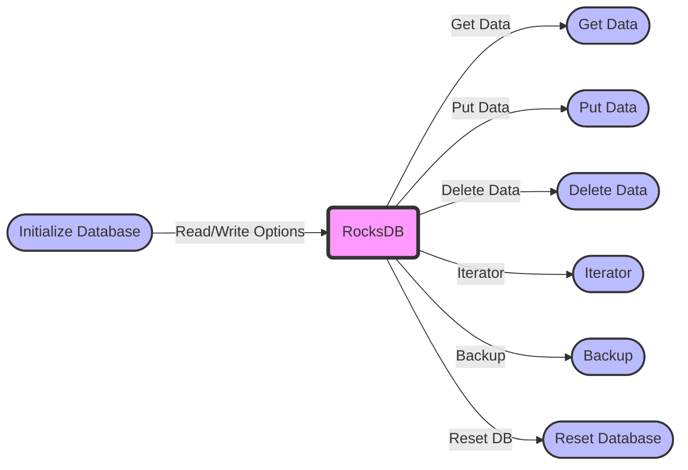

## Module: RocksDbDataSourceImpl.java
由于原文代码非常长，下面是基于提供的代码模块的综合分析概要，已翻译成中文：

- **模块名称**：RocksDbDataSourceImpl.java

- **主要目标**：此模块的目的是提供一个具体的实现，用于通过RocksDB存储和检索字节数据，服务于更高级别的数据管理和操作需求。

- **关键函数**：
  - `initDB()`：初始化数据库设置和配置。
  - `closeDB()`：关闭数据库连接。
  - `resetDb()`：重置数据库，包括关闭和删除现有数据库文件。
  - `putData(byte[] key, byte[] value)`：将键值对存储到数据库中。
  - `getData(byte[] key)`：根据键检索值。
  - `deleteData(byte[] key)`：根据键删除数据。
  - `updateByBatch(Map<byte[], byte[]> rows)`：批量更新数据库中的数据。
  - `getKeysNext(byte[] key, long limit)` 和 `getNext(byte[] key, long limit)`：检索与给定键相关的下一批数据。
  - `backup(String dir)`：备份数据库到指定目录。

- **关键变量**：
  - `dataBaseName`：数据库名称。
  - `parentPath`：数据库文件存储的父路径。
  - `database`：RocksDB数据库实例。
  - `alive`：表示数据库是否处于活跃状态。
  - `resetDbLock`：用于数据库重置操作的读写锁。

- **依赖性**：此模块依赖于RocksDB库以及Java的并发和I/O操作。

- **核心 vs. 辅助操作**：
  - 核心操作包括数据的存储、检索和删除。
  - 辅助操作包括数据库的初始化、备份和批量更新。

- **操作序列**：通常，操作开始于数据库的初始化（`initDB()`），随后是数据的存储、检索或删除操作，最终可能包括数据库的关闭或重置。

- **性能方面**：性能考虑包括数据库配置的优化（如并行级别、压缩设置等），以及通过批量操作和有效的读写锁管理来提高效率。

- **可重用性**：此模块设计为可重用，可以通过指定不同的数据库名称和路径来创建多个实例。

- **使用**：此模块被用于需要持久化存储键值数据的应用中，特别是在区块链和分布式系统的上下文中。

- **假设**：假设操作系统支持RocksDB的所有依赖性，并且有足够的磁盘空间来存储数据库文件。此外，还假设调用者负责在并发环境中适当地管理数据库实例的生命周期。

这个分析提供了对`RocksDbDataSourceImpl.java`模块功能和设计的高层次概述。
## Flow Diagram [via mermaid]

