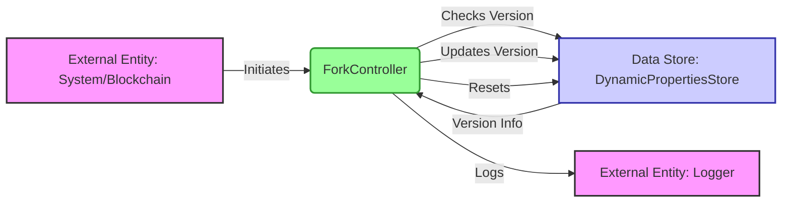

## Module: ForkController.java
模块名称：ForkController.java

主要目的：此模块的主要目的是管理和控制区块链网络中的硬分叉版本升级和降级。它负责检测网络中的节点是否支持新的区块版本，并据此决定是否激活新版本的特性。

关键函数：
- `init(ChainBaseManager manager)`: 初始化ForkController，设置基础管理器并更新最新版本信息。
- `pass(ForkBlockVersionEnum forkBlockVersionEnum)`: 检查是否通过指定的分叉版本。
- `update(BlockCapsule blockCapsule)`: 更新区块信息，根据区块版本和见证人信息决定是否升级或降级。
- `reset()`: 重置分叉控制器的状态，通常在特定条件下调用。
- `instance()`: 获取ForkController的实例。

关键变量：
- `VERSION_UPGRADE` 和 `VERSION_DOWNGRADE`: 分别表示版本升级和降级的标志。
- `check`: 用于记录版本检查结果的数组。
- `manager`: ChainBaseManager的实例，用于访问动态属性存储等。

依赖关系：此模块依赖于`ChainBaseManager`来获取区块链的动态属性和状态信息，以及`DynamicPropertiesStore`来存取最新的版本信息和统计数据。

核心与辅助操作：核心操作包括版本检查（`pass`方法）、版本升级和降级（`update`方法），以及状态重置（`reset`方法）。辅助操作包括初始化和获取实例。

操作序列：在区块链运行过程中，`update`方法会根据新产生的区块信息不断调用，以决定是否需要版本升级或降级。`reset`方法在特定情况下用于重置状态。

性能方面：此模块需要高效地处理版本检查和更新操作，尤其是在区块链网络中节点数量众多时。优化数组和循环操作对提升性能至关重要。

可重用性：ForkController设计为可重用的单例模式，可在需要管理分叉版本的不同场景下使用。

使用：在区块链系统中，此模块被用于管理网络中的版本升级和降级，以确保网络的平稳运行和新特性的顺利引入。

假设：假设所有节点在网络中的行为是诚实的，并且能够及时更新软件以支持新的区块版本。此外，还假设`DynamicPropertiesStore`能够准确反映当前网络的状态。
## Flow Diagram [via mermaid]

