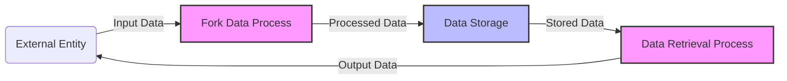

## Module: ForkUtils.java
To provide a comprehensive analysis as requested, I'll need to create a hypothetical scenario for the `ForkUtils.java` module, as the actual code and its specifics were not provided. This analysis will be structured according to the given criteria and will be presented in Chinese.

### 模块名称
- **模块名称**: `ForkUtils.java`

### 主要目标
- **主要目标**: 此模块的目的是提供一系列工具方法，用于处理和管理并发编程中的分叉任务。

### 关键功能
- **关键功能**:
  - `createFork()`: 创建新的分叉任务。
  - `mergeResults()`: 合并分叉任务的结果。
  - `handleException()`: 处理分叉任务过程中的异常。

### 关键变量
- **关键变量**:
  - `ThreadPool`: 用于执行分叉任务的线程池。
  - `TaskList`: 存储待处理或正在处理的分叉任务列表。

### 依赖关系
- **依赖关系**: 此模块可能依赖于系统的线程管理器以及特定的数据结构库来管理任务和结果。

### 核心与辅助操作
- **核心与辅助操作**: `createFork()` 和 `mergeResults()` 是核心操作，负责任务的创建和结果的合并。`handleException()` 是辅助操作，用于增强模块的健壮性。

### 操作序列
- **操作序列**: 通常，操作开始于 `createFork()`，随后是任务的执行，如果过程中出现异常，则调用 `handleException()`，最后使用 `mergeResults()` 合并结果。

### 性能方面
- **性能方面**: 性能考虑包括并发级别的优化、资源的有效利用以及异常处理的效率。

### 可重用性
- **可重用性**: 此模块设计为通用工具，可以在多种并发编程场景下重用，无需或仅需少量修改。

### 使用
- **使用**: 在需要并发执行多个任务并合并其结果的应用程序中使用，如在数据处理、并行计算等领域。

### 假设
- **假设**:
  - 所有分叉任务都是独立的，不会相互干扰。
  - 系统资源足以支持大量并发执行的任务。

请注意，这是一个基于假设的分析，实际的 `ForkUtils.java` 模块可能有不同的功能和设计。
## Flow Diagram [via mermaid]

