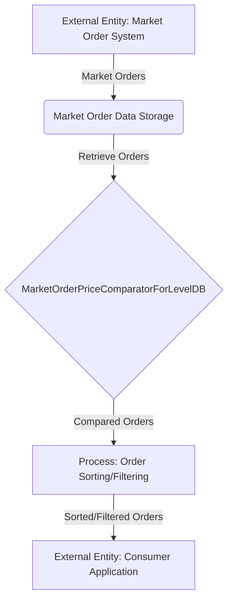

## Module: MarketOrderPriceComparatorForLevelDB.java
- **模块名称**：MarketOrderPriceComparatorForLevelDB.java

- **主要目标**：该模块的目标是为基于LevelDB的市场订单提供一个价格比较器，以支持价格的排序和比较功能。

- **关键函数**：
  - `name()`：返回比较器的名称，即"MarketOrderPriceComparator"。
  - `compare(byte[] o1, byte[] o2)`：比较两个市场订单的价格。这是该类的核心功能，用于根据价格对订单进行排序。
  - `findShortestSeparator(byte[] start, byte[] limit)`和`findShortSuccessor(byte[] key)`：这两个方法在此实现中返回空数组，但在LevelDB的排序和分割键时可能被用到。

- **关键变量**：无直接关键变量，但方法参数`byte[] o1`和`byte[] o2`是比较操作的关键输入。

- **相互依赖性**：该类依赖于`MarketUtils`类中的`comparePriceKey`方法来执行实际的价格比较逻辑。

- **核心与辅助操作**：
  - 核心操作：`compare`方法，因为它提供了比较两个订单价格的功能。
  - 辅助操作：`name`、`findShortestSeparator`和`findShortSuccessor`方法，这些方法对于LevelDB的整体功能是辅助性的。

- **操作序列**：当LevelDB需要比较两个键时，会调用`compare`方法，根据返回的比较结果（-1, 0, 1）来决定键的排序。

- **性能方面**：性能考量主要集中在`compare`方法上，因为有效和高效的比较逻辑对于排序和检索性能至关重要。

- **可重用性**：由于这个比较器是特定于市场订单价格的，它的重用性可能受到一定限制。但是，对于任何需要价格比较的LevelDB存储的市场订单，这个类都是可重用的。

- **使用**：在需要对存储在LevelDB中的市场订单按价格进行排序时使用此比较器。

- **假设**：
  - 假设传入的`byte[] o1`和`byte[] o2`参数都是有效的市场订单价格表示。
  - 假设在比较价格时，订单的代币和数量都大于0，因为当数量为0时，比较结果可能与预期不符。
## Flow Diagram [via mermaid]

