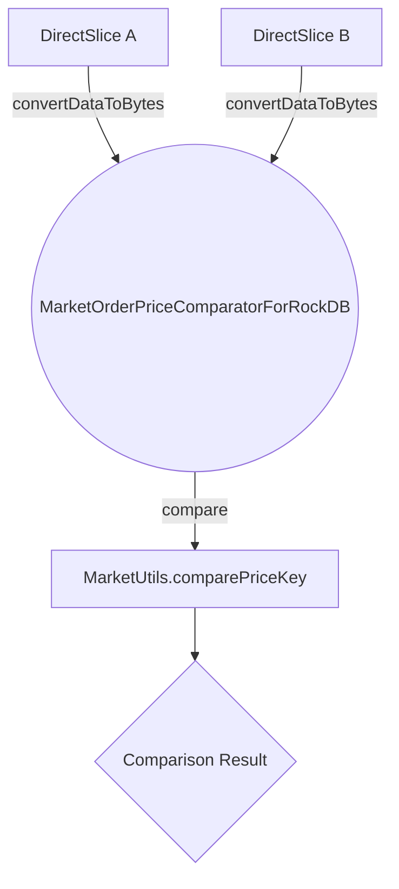

## Module: MarketOrderPriceComparatorForRockDB.java
**模块名称**：MarketOrderPriceComparatorForRockDB.java

**主要目标**：该模块的目的是为了在RocksDB中比较市场订单价格，提供一个定制的比较器。

**关键函数**：
- `MarketOrderPriceComparatorForRockDB(final ComparatorOptions copt)`：构造函数，初始化比较器。
- `compare(final DirectSlice a, final DirectSlice b)`：比较两个DirectSlice对象，通过将它们转换为字节并使用`MarketUtils.comparePriceKey`方法进行价格比较。
- `convertDataToBytes(DirectSlice directSlice)`：将DirectSlice对象转换为字节数组，因为直接访问DirectSlice的数据数组可能会抛出UnsupportedOperationException。

**关键变量**：
- 无明显的关键变量，但`DirectSlice`对象在`compare`和`convertDataToBytes`方法中起着中心作用。

**依赖关系**：
- 该模块依赖于`org.rocksdb`包中的类进行底层数据操作。
- 依赖于`MarketUtils`类中的`comparePriceKey`方法来进行价格的比较逻辑。

**核心与辅助操作**：
- 核心操作：`compare`方法，用于比较价格。
- 辅助操作：`convertDataToBytes`方法，支持将DirectSlice对象转换为字节，以便进行比较。

**操作序列**：
1. `compare`方法被调用，传入两个DirectSlice对象。
2. 这两个对象通过`convertDataToBytes`方法转换为字节数组。
3. 使用`MarketUtils.comparePriceKey`方法比较这两个字节数组。
4. 返回比较结果。

**性能方面**：
- 性能考虑主要集中在有效地将DirectSlice对象转换为字节数组，以及如何高效比较这些字节数组。
- 使用直接操作字节的方式可能会提高性能，减少不必要的对象创建。

**可重用性**：
- 该比较器专为RocksDB中的市场订单价格比较设计，但`convertDataToBytes`方法在处理DirectSlice对象时可能具有一定的通用性。

**使用**：
- 在RocksDB数据库环境中，当需要根据市场订单的价格进行排序或比较时，可以使用此比较器。

**假设**：
- 假设所有市场订单的价格可以通过比较字节数组来有效比较。
- 假设DirectSlice对象中的数据是价格信息的有效表示。
## Flow Diagram [via mermaid]

