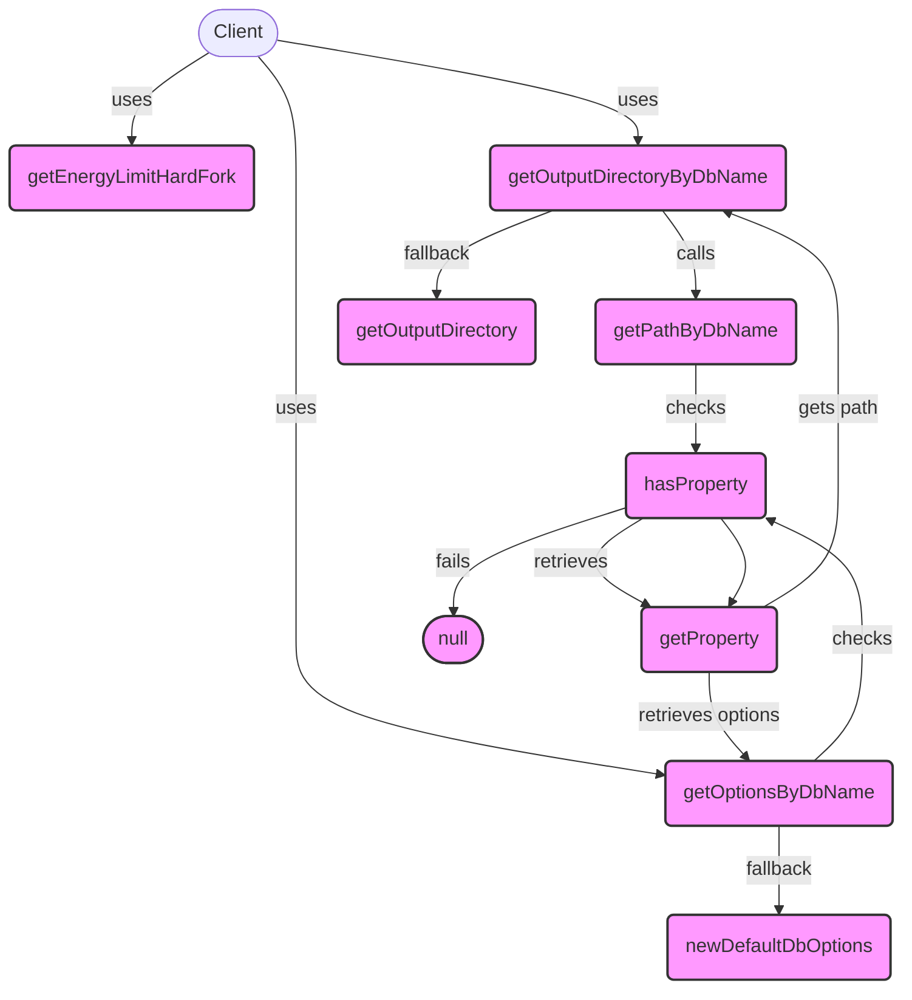

## Module: StorageUtils.java
- **模块名称**：StorageUtils.java

- **主要目标**：该模块的目的是提供与存储相关的实用功能，特别是与数据库名称、路径和选项相关的功能。

- **关键函数**：
  - `getEnergyLimitHardFork()`：返回能量限制硬分叉的状态。
  - `getOutputDirectoryByDbName(String dbName)`：根据数据库名称获取输出目录。
  - `getPathByDbName(String dbName)`：根据数据库名称获取路径。
  - `hasProperty(String dbName)`：检查是否存在给定数据库名称的属性。
  - `getProperty(String dbName)`：获取指定数据库名称的属性。
  - `getOutputDirectory()`：获取输出目录。
  - `getOptionsByDbName(String dbName)`：根据数据库名称获取数据库选项。

- **关键变量**：
  - `ENERGY_LIMIT_HARD_FORK`：一个静态变量，表示能量限制硬分叉的状态。

- **相互依赖性**：此模块依赖于`CommonParameter`类来获取存储配置和参数，如输出目录和数据库属性。

- **核心与辅助操作**：核心操作包括获取数据库路径、输出目录和数据库选项。辅助操作包括检查属性存在与否。

- **操作序列**：首先，根据需要检查数据库名称的属性是否存在，然后根据这些属性获取路径、输出目录或数据库选项。

- **性能方面**：性能考虑可能包括如何有效地访问和缓存数据库属性以减少重复查询。

- **可重用性**：此模块的设计允许它在需要处理存储路径和数据库选项的不同部分的应用程序中重用。

- **使用**：该模块被用于管理和配置与区块链节点存储相关的参数，如数据库路径和选项。

- **假设**：
  - 假设`CommonParameter`类始终可用并正确配置。
  - 假设数据库名称是唯一的，并且可以用作检索特定存储属性的键。
## Flow Diagram [via mermaid]

