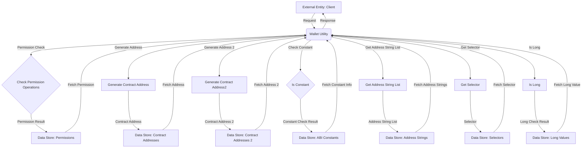

## Module: WalletUtil.java
根据提供的代码模块，以下是其详细分析：

- **模块名称**：WalletUtil.java

- **主要目标**：该模块的目的是提供与钱包操作相关的工具方法，包括权限检查、生成合约地址、判断合约调用是否为常量调用等。

- **关键函数**：
  - `checkPermissionOperations`：检查交易的权限。
  - `generateContractAddress`：根据交易生成合约地址。
  - `generateContractAddress2`：使用CREATE2算法生成合约地址。
  - `isConstant`：判断智能合约的调用是否为常量调用。
  - `getAddressStringList`：将地址集合转换为字符串列表。
  - `getSelector`：从数据中获取选择器。
  - `isLong`：尝试将字符串解析为长整型。

- **关键变量**：无特别指出的关键变量，但函数参数和返回值对模块功能至关重要。

- **互依赖性**：该模块与`ContractCapsule`、`TransactionCapsule`、`Hash`等其他系统组件有互动，用于处理交易和智能合约的数据。

- **核心与辅助操作**：
  - 核心操作包括生成合约地址、权限检查和判断常量调用。
  - 辅助操作包括地址转换为字符串列表和解析长整型。

- **操作序列**：不同的功能方法可以根据需要独立调用，没有特定的操作序列。

- **性能方面**：性能考虑可能包括对智能合约数据的处理效率，以及生成合约地址的算法效率。

- **可复用性**：此模块提供的多个工具方法具有较高的可复用性，可在不同的上下文中用于处理与钱包和智能合约相关的操作。

- **使用**：该模块被用于处理与钱包相关的各种操作，如权限检查、生成合约地址、判断智能合约调用的性质等，在区块链应用开发中非常有用。

- **假设**：在执行某些方法时，假设输入参数的格式和类型是正确的，例如在生成合约地址或判断常量调用时。

这个分析提供了对`WalletUtil.java`模块功能和作用的全面理解，以及它在系统中如何与其他组件交互。
## Flow Diagram [via mermaid]

