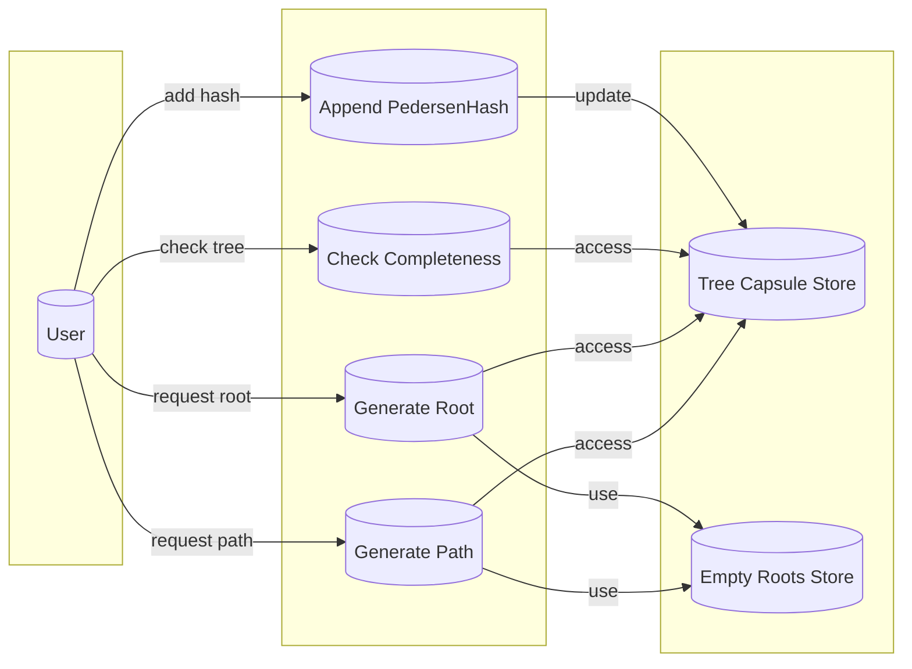

## Module: IncrementalMerkleTreeContainer.java
- **模块名称**：IncrementalMerkleTreeContainer.java

- **主要目的**：该模块的目的是实现一个增量默克尔树容器，用于管理和操作增量默克尔树，支持向树中添加新的元素，以及生成树的根哈希和验证路径。

- **关键函数**：
  - `append(PedersenHash obj)`：向默克尔树中添加新的Pedersen哈希。
  - `root()`：计算并返回当前默克尔树的根哈希。
  - `path()`：生成从叶节点到根的验证路径。
  - `isComplete()`：检查树是否已满。
  - `wfcheck()`：检查树的结构是否符合预期，确保没有错误的表示。

- **关键变量**：
  - `DEPTH`：树的深度。
  - `treeCapsule`：存储当前树的状态和内容的容器。

- **相互依赖性**：与`IncrementalMerkleTreeCapsule`、`PedersenHashCapsule`等类相互作用，用于存储树节点信息和执行哈希组合操作。

- **核心与辅助操作**：核心操作包括添加新元素、生成根哈希和验证路径。辅助操作包括检查树的完整性和结构正确性。

- **操作序列**：通常从创建实例开始，依次添加元素，随后可以生成根哈希或验证路径，过程中会进行完整性和结构检查。

- **性能方面**：性能考虑包括哈希计算的效率、树的深度对操作时间的影响，以及动态数据结构的内存使用。

- **可重用性**：该模块设计为通用的增量默克尔树实现，可以在需要管理哈希树的不同上下文中重用。

- **使用**：主要用于需要证明元素包含在某个集合中而不暴露整个集合内容的场景，如隐私保护交易。

- **假设**：假定所有输入的哈希值都是有效的，树的深度是预先定义好的，且所有操作都在树的容量范围内执行。

这个分析提供了对`IncrementalMerkleTreeContainer`模块的全面理解，从其目的、关键功能到性能考虑和使用场景。
## Flow Diagram [via mermaid]

