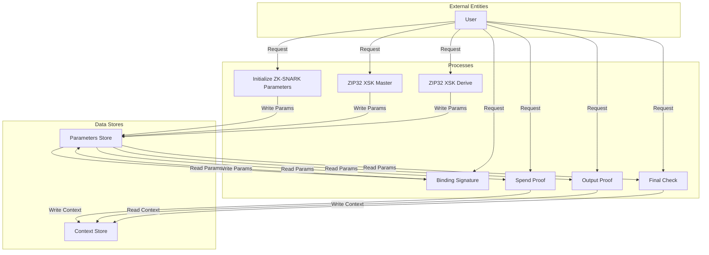

## Module: JLibrustzcash.java
模块名称：JLibrustzcash.java

主要目标：该模块的主要目的是提供与Zcash相关的加密操作和零知识证明的功能，以支持隐私保护交易。

关键功能：
- `librustzcashZip32XskMaster`：生成主密钥。
- `librustzcashInitZksnarkParams`：初始化Zksnark参数。
- `librustzcashZip32XskDerive`：派生子密钥。
- `librustzcashCrhIvk`、`librustzcashKaAgree`、`librustzcashComputeCm`、`librustzcashComputeNf`：执行各种加密计算。
- `librustzcashSaplingGenerateR`、`librustzcashSaplingKaDerivepublic`：生成随机数和公钥。
- `librustzcashSaplingProvingCtxInit`、`librustzcashSaplingProvingCtxFree`：证明上下文的初始化和释放。
- `librustzcashSaplingVerificationCtxInit`、`librustzcashSaplingVerificationCtxFree`：验证上下文的初始化和释放。
- `librustzcashSaplingSpendProof`、`librustzcashSaplingOutputProof`、`librustzcashSaplingSpendSig`、`librustzcashSaplingBindingSig`：生成零知识证明和签名。
- `librustzcashSaplingCheckSpend`、`librustzcashSaplingCheckOutput`、`librustzcashSaplingFinalCheck`：验证零知识证明和签名。

关键变量：
- `INSTANCE`：Librustzcash的实例。

依赖性：该模块依赖于`LibrustzcashWrapper`来实现具体的功能，同时依赖`CommonParameter`来获取系统配置。

核心与辅助操作：核心操作包括加密计算、零知识证明的生成和验证。辅助操作包括上下文的初始化和释放，以及参数的校验。

操作序列：一般首先进行参数初始化，然后执行加密计算或生成证明，最后进行证明的验证。

性能方面：性能考虑包括加密操作和零知识证明生成的效率，以及对内存和计算资源的管理。

可重用性：该模块设计为可重用的加密库，可以支持不同的上层应用。

使用：主要被用于支持Tron网络中的隐私保护交易。

假设：假设系统配置允许进行隐私保护交易，并且用户提供的参数是有效的。
## Flow Diagram [via mermaid]

