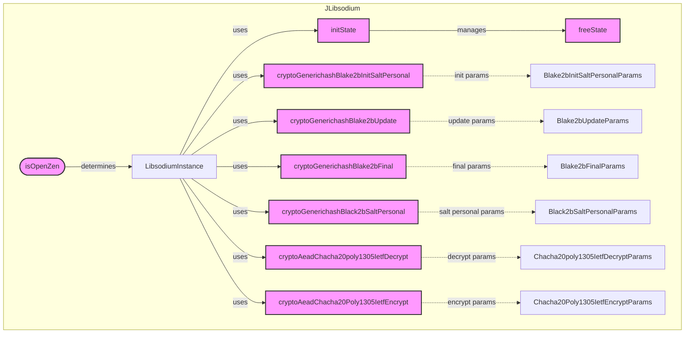

## Module: JLibsodium.java
模块名称：JLibsodium

主要目标：JLibsodium模块的主要目的是提供一个接口，用于执行加密哈希和加密/解密操作，特别是与Blake2b和Chacha20Poly1305算法相关的操作。这些功能对于保证数据的安全性和完整性至关重要。

关键函数：
- `cryptoGenerichashBlake2bInitSaltPersonal`：初始化带有盐和个人化参数的Blake2b哈希。
- `cryptoGenerichashBlake2bUpdate`：更新Blake2b哈希状态。
- `cryptoGenerichashBlake2bFinal`：完成Blake2b哈希计算。
- `cryptoGenerichashBlack2bSaltPersonal`：直接生成带有盐和个人化参数的Blake2b哈希。
- `cryptoAeadChacha20poly1305IetfDecrypt`：使用Chacha20Poly1305算法解密数据。
- `cryptoAeadChacha20Poly1305IetfEncrypt`：使用Chacha20Poly1305算法加密数据。
- `initState`：初始化Blake2b哈希状态。
- `freeState`：释放Blake2b哈希状态。

关键变量：
- `CRYPTO_GENERICHASH_BLAKE2B_PERSONALBYTES`：指定个人化参数的字节大小。
- `CRYPTO_AEAD_CHACHA20POLY1305_IETF_NPUBBYTES`：指定公开随机数的字节大小。
- `INSTANCE`：Libsodium库的实例。

依赖关系：此模块依赖于`LibsodiumWrapper`类来实际执行加密操作，同时还依赖于`CommonParameter`类来检查系统是否允许执行保护性交易操作。

核心与辅助操作：核心操作包括加密哈希的初始化、更新、完成以及加密/解密操作。辅助操作包括状态的初始化和释放。

操作序列：一般首先通过`initState`初始化状态，然后使用`cryptoGenerichashBlake2bUpdate`进行多次更新（如果需要），最后通过`cryptoGenerichashBlake2bFinal`完成哈希计算。对于加密/解密操作，则直接调用相应的加密或解密函数。

性能方面：性能考虑包括算法的执行效率和内存使用。Libsodium是为高性能而设计，但具体性能会根据使用的硬件和操作系统差异而有所不同。

可重用性：此模块设计为可重用，可以轻松集成到需要加密功能的其他Java应用程序中。

使用方式：通过调用模块中的静态方法，开发者可以在其应用程序中实现对数据的加密哈希和加密/解密操作。

假设：假设系统已经正确配置了Libsodium库，并且`CommonParameter.getInstance().isFullNodeAllowShieldedTransactionArgs()`返回`true`，允许执行加密操作。
## Flow Diagram [via mermaid]

