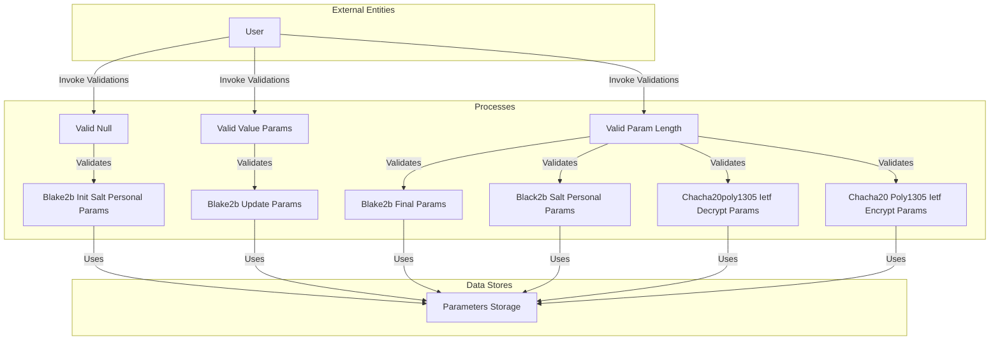

## Module: JLibsodiumParam.java
- **模块名称**：JLibsodiumParam.java

- **主要目标**：该模块的目的是提供一系列参数验证功能，以支持加密操作的安全性和正确性，特别是与zk-SNARKs（零知识简洁非交互式知识论证）和其他加密算法相关的功能。

- **关键函数**：
   - `validNull`：验证字节数组是否为null或空。
   - `validValueParams`：验证数值参数是否为非负。
   - `validParamLength`：验证给定字节数组的长度是否符合预期。
   - `Blake2bInitSaltPersonalParams`、`Blake2bUpdateParams`、`Blake2bFinalParams`、`Black2bSaltPersonalParams`、`Chacha20poly1305IetfDecryptParams`、`Chacha20Poly1305IetfEncryptParams`类：实现`ValidParam`接口，提供特定于各自操作的参数验证。

- **关键变量**：
   - 各个参数类中的成员变量，如`state`、`key`、`keyLen`、`outLen`、`salt`、`personal`、`in`、`inLen`、`out`、`m`、`mLenP`、`nSec`、`c`、`cLen`、`ad`、`adLen`、`nPub`、`k`等，这些变量对应于加密操作中的关键数据。

- **相互依赖性**：
   - 该模块与系统中负责加密操作的其他组件有依赖关系，特别是与实现具体加密算法的库（如Libsodium）的交互。

- **核心与辅助操作**：
   - 核心操作包括参数的验证过程，这是确保加密操作安全性和正确性的基础。
   - 辅助操作可能包括设置和获取参数类中的各种变量的值。

- **操作序列**：
   - 在进行加密或解密操作之前，首先通过相应的参数验证方法（如`valid`方法）来确保所有输入参数都满足特定的要求。

- **性能方面**：
   - 参数验证步骤可能会对性能产生一定影响，但这是确保操作安全性的必要步骤。

- **可重用性**：
   - 该模块设计为通用的参数验证工具，可以在多种加密操作中重用，提高了代码的复用性和维护性。

- **使用方式**：
   - 在执行加密或解密操作之前，使用此模块提供的方法对必要的参数进行验证，以确保它们符合预期的要求。

- **假设**：
   - 假设所有输入参数都是预期格式和类型，验证方法将基于这些假设来检查参数的有效性。
## Flow Diagram [via mermaid]

