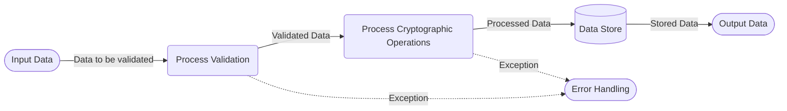

## Module: LibrustzcashParam.java
**模块名称**：LibrustzcashParam

**主要目标**：该模块的目的是为了提供一系列的参数验证方法，以确保在执行zk-SNARK（零知识简洁非交互式知识论证）相关操作时传递的参数符合预期要求。

**关键函数**：
- `validNull`：验证字节数组是否为null或零长度。
- `validObjectNull`：验证对象是否为null。
- `validByteValue`：验证两个字节值是否相等。
- `validParamLength`：验证字节数组的长度是否符合预期。
- `valid11Params`、`valid32Params`：验证字节数组长度是否为11或32。
- `validVoucherPath`：验证凭证路径的格式和长度。
- `validValueParams`、`validPositionParams`：验证数值是否为非负。
- 各种`ValidParam`接口的实现类，用于特定参数集的验证。

**关键变量**：
- 各种`@Setter`和`@Getter`注解的私有变量，如`spend_path`、`spend_hash`、`output_path`、`output_hash`等，这些变量在不同的参数验证类中用于存储待验证的数据。

**依赖关系**：
- 该模块主要与`org.tron.common.utils`包中的`ByteArray`和`ByteUtil`工具类进行交互，用于执行字节操作和验证。

**核心操作与辅助操作**：
- 核心操作是参数的验证，确保传递的参数满足zk-SNARK操作的要求。
- 辅助操作包括通过`Setter`和`Getter`方法设置和获取变量值。

**操作序列**：
- 通常，操作序列开始于通过公开方法接收参数，随后执行一系列的验证操作，如长度验证、空值验证和数值范围验证。

**性能方面**：
- 性能考虑主要集中在避免不必要的验证操作和优化字节操作，尽量减少对性能的影响。

**可重用性**：
- 该模块设计为可重用的验证工具，可在需要参数验证的多个场景中使用。

**使用情况**：
- 在需要进行zk-SNARK操作的场景中使用，如加密货币交易的隐私保护等。

**假设**：
- 假设传入的参数类型和格式符合方法的预期，例如，当一个方法期望一个长度为32的字节数组时，调用者需要确保传入的数组符合这一要求。

通过这些分析点，我们可以更深入地理解`LibrustzcashParam`模块的设计和功能，以及它在系统中的作用和重要性。
## Flow Diagram [via mermaid]

