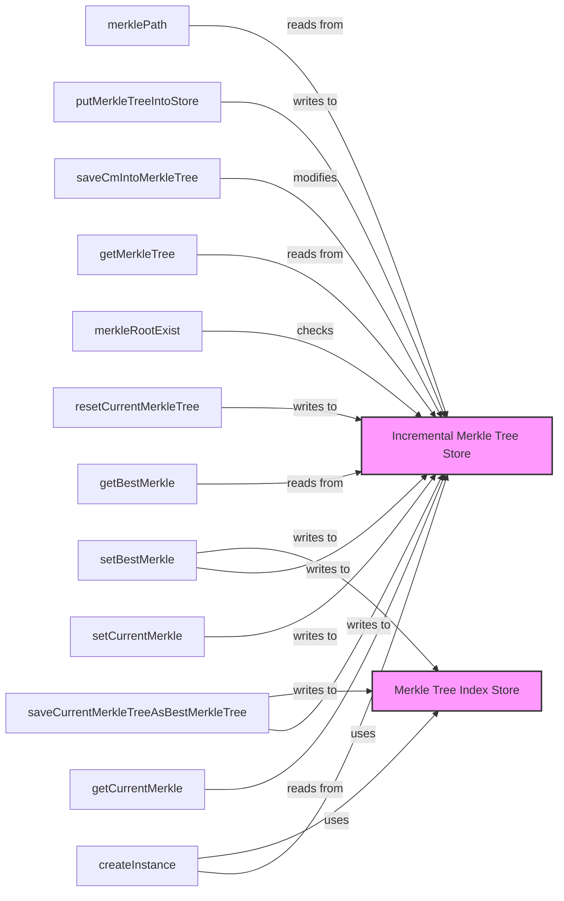

## Module: MerkleContainer.java
**模块名称**：MerkleContainer.java

**主要目标**：该模块的目的是管理和操作增量默克尔树（Merkle Tree），提供了一种方式来维护和更新区块链的状态，同时确保数据的完整性和安全性。

**关键功能**：
- `createInstance`：用于创建MerkleContainer的实例。
- `getCurrentMerkle`：获取当前的默克尔树。
- `setCurrentMerkle`：设置当前的默克尔树。
- `getBestMerkle`：获取最佳的默克尔树。
- `resetCurrentMerkleTree`：重置当前的默克尔树。
- `saveCurrentMerkleTreeAsBestMerkleTree`：将当前的默克尔树保存为最佳默克尔树。
- `setBestMerkle`：设置最佳默克尔树。
- `merkleRootExist`：检查默克尔根是否存在。
- `getMerkleTree`：根据默克尔根获取默克尔树。
- `saveCmIntoMerkleTree`：将提交（Commitment）保存到默克尔树中。
- `putMerkleTreeIntoStore`：将默克尔树保存到存储中。
- `merklePath`：获取默克尔路径。

**关键变量**：
- `lastTreeKey`：用于标识最后一个树的键。
- `currentTreeKey`：用于标识当前树的键。
- `incrementalMerkleTreeStore`：增量默克尔树存储。
- `merkleTreeIndexStore`：默克尔树索引存储。

**依赖关系**：
- 与`IncrementalMerkleTreeStore`和`TreeBlockIndexStore`有直接的交互，用于存取和管理默克尔树及其索引。

**核心与辅助操作**：
- 核心操作包括管理默克尔树的创建、更新和获取。
- 辅助操作包括将默克尔树保存到存储中、从存储中获取默克尔树等。

**操作序列**：
1. 创建MerkleContainer实例。
2. 获取或设置当前默克尔树。
3. 在需要时更新当前默克尔树或将其保存为最佳树。
4. 将默克尔树的更改保存到存储中。

**性能方面**：
- 需要注意的性能考虑包括默克尔树的存储和检索效率，以及默克尔路径的计算效率。

**可重用性**：
- 该模块设计为可重用，可以在需要管理增量默克尔树的不同区块链项目中使用。

**使用**：
- 主要用于区块链项目中，用于维护区块链的状态，确保数据的完整性和安全性。

**假设**：
- 假设存储系统是可靠的，能够有效地存取和管理默克尔树数据。
## Flow Diagram [via mermaid]

