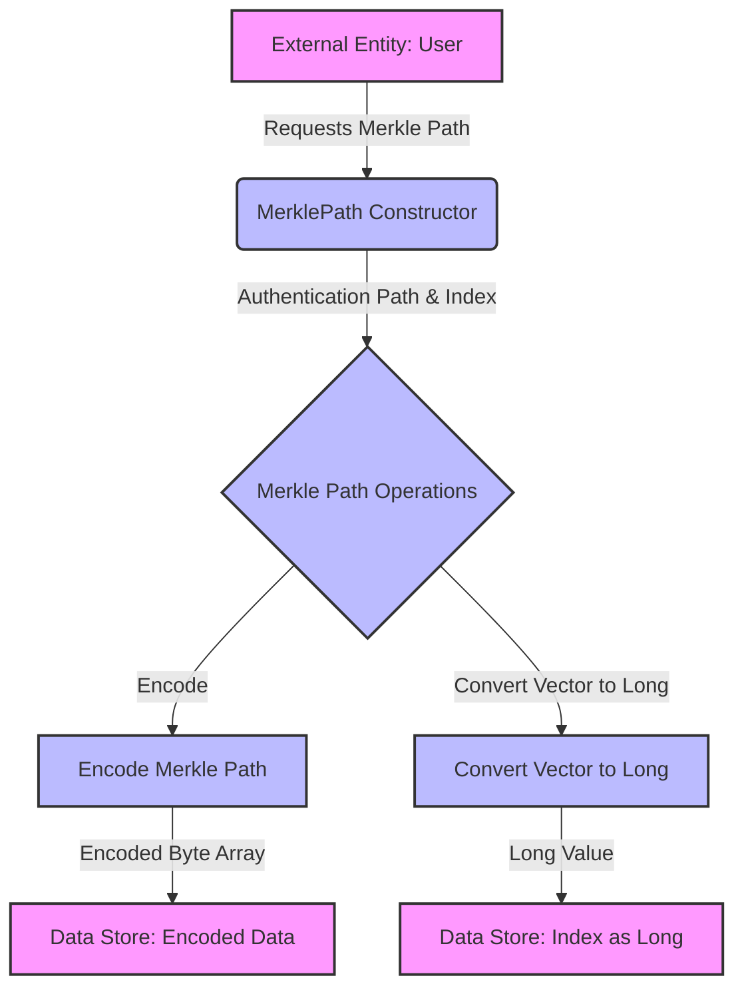

## Module: MerklePath.java
根据提供的代码模块，以下是用中文进行的综合分析：

- **模块名称**：MerklePath.java

- **主要目的**：该模块用于生成和处理默克尔路径（Merkle Path），主要用于区块链中的默克尔树验证过程。

- **关键函数**：
  - `MerklePath(List<List<Boolean>> authenticationPath, List<Boolean> index)`：构造函数，初始化认证路径和索引。
  - `encode()`：将认证路径和索引编码为字节数组，用于进一步处理或传输。
  - `listList2Bytes(List<List<Byte>> v)`：私有静态方法，将字节列表的列表转换为字节数组。
  - `writeCompactSize(long nSize)`：私有静态方法，根据给定的大小写入紧凑格式的字节数组。
  - `convertVectorToLong(List<Boolean> v)`：私有静态方法，将布尔值列表转换为长整型数值。

- **关键变量**：
  - `authenticationPath`：认证路径，存储默克尔树中的节点。
  - `index`：索引，表示数据在默克尔树中的位置。

- **相互依赖性**：该模块依赖于`org.tron.common.utils.ByteArray`和`org.tron.common.utils.ByteUtil`等工具类来进行字节操作和转换。

- **核心 vs. 辅助操作**：
  - 核心操作包括构造默克尔路径、编码过程。
  - 辅助操作包括各种私有方法，如`listList2Bytes`、`writeCompactSize`和`convertVectorToLong`，这些方法支持核心功能的实现。

- **操作序列**：首先，通过构造函数初始化认证路径和索引。然后，调用`encode`方法将这些信息编码为字节数组，以便进行验证或其他处理。

- **性能方面**：性能考虑主要涉及到数据结构的选择和编码过程的效率。使用列表和字节数组来存储和操作数据，旨在优化内存使用和处理速度。

- **可重用性**：该模块设计为可重用，可以在需要进行默克尔树验证的不同区块链项目中使用。

- **用途**：主要用于区块链技术中，特别是在需要验证数据完整性和一致性的场景下，如交易验证。

- **假设**：假设所有输入数据都是有效的，并且调用方法时遵循正确的顺序。同时，假设认证路径和索引正确匹配，以确保验证过程的准确性。

这个综合分析概述了`MerklePath.java`模块的关键方面，包括它的目的、功能、以及如何在区块链技术中被使用。
## Flow Diagram [via mermaid]

