## Module: ChainBaseManager.java
由于您提供的代码模块是一个Java类，我将基于此进行分析：

- **模块名称**：ChainBaseManager.java

- **主要目标**：该类的目的是作为区块链的基础管理器，负责区块链数据的管理和操作，包括账户、区块、交易等数据的存储和访问。

- **关键函数**：
  - `initGenesis()`：初始化创世区块。
  - `getHead()`：获取最新的区块。
  - `getHeadBlockId()`：获取最新区块的ID。
  - `containBlock()`、`containBlockInMainChain()`：判断区块是否存在。
  - `getBlockById()`：通过区块哈希获取区块。
  - `setBlockReference()`：设置交易的区块引用。
  - `getSolidBlockId()`、`getGenesisBlockId()`：获取已确认的区块ID和创世区块ID。
  - `getBlockByNum()`：通过区块编号获取区块。
  - `shutdown()`：关闭数据库统计服务。

- **关键变量**：
  - `chainBaseManager`：ChainBaseManager的静态实例。
  - `accountStore`、`blockStore`、`witnessStore` 等：各种数据存储服务。
  - `genesisBlock`：创世区块。
  - `nodeType`：节点类型，区分全节点和轻节点。
  - `lowestBlockNum`：除了编号为0的区块外，最低的区块编号。

- **依赖关系**：
  - 该类依赖于Spring框架进行依赖注入，通过@Autowired注解自动注入各种数据库存储服务。
  - 依赖于`ForkController`类来处理区块链分叉情况。
  - 与`AssetUtil`、`BlockUtil`等工具类有交互，用于区块和资产的处理。

- **核心 vs. 辅助操作**：
  - 核心操作包括区块的获取、验证和存储。
  - 辅助操作包括节点类型的判断、数据库统计服务的关闭等。

- **操作序列**：
  - 在类初始化时（@PostConstruct标注的init方法），会根据区块索引的情况设置节点类型和最低区块编号。
  - 通过`init(ChainBaseManager manager)`静态方法初始化静态实例。

- **性能方面**：
  - 性能考虑可能包括数据库的读写效率，特别是在处理大量数据时的优化。
  - 对于`containBlock`等方法，需要高效地判断区块是否存在，减少不必要的数据库访问。

- **可重用性**：
  - 该类作为区块链的基础管理组件，具有较高的可重用性，可以在不同的区块链项目中作为数据管理的基础架构。

- **使用方式**：
  - 作为Spring组件（@Component），该类的实例由Spring容器管理。
  - 通过`getInstance()`静态方法获取实例，进行区块链数据的管理操作。

- **假设**：
  - 假设所有的数据存储服务都已正确配置和初始化。
  - 假设节点在启动时能正确初始化创世区块和其他必要的数据结构。

以上是根据您提供的代码模块进行的分析。如果有更具体的代码片段或功能需求，可以进一步细化分析。
## Flow Diagram [via mermaid]

```mermaid
graph TD
    ChainBaseManager[ChainBaseManager] -->|uses| AccountStore[Account Store]
    ChainBaseManager -->|uses| AccountAssetStore[Account Asset Store]
    ChainBaseManager -->|uses| BlockStore[Block Store]
    ChainBaseManager -->|uses| WitnessStore[Witness Store]
    ChainBaseManager -->|uses| AssetIssueStore[Asset Issue Store]
    ChainBaseManager -->|uses| AssetIssueV2Store[Asset Issue V2 Store]
    ChainBaseManager -->|uses| DynamicPropertiesStore[Dynamic Properties Store]
    ChainBaseManager -->|uses| BlockIndexStore[Block Index Store]
    ChainBaseManager -->|uses| AccountIdIndexStore[Account ID Index Store]
    ChainBaseManager -->|uses| AccountIndexStore[Account Index Store]
    ChainBaseManager -->|uses| WitnessScheduleStore[Witness Schedule Store]
    ChainBaseManager -->|uses| VotesStore[Votes Store]
    ChainBaseManager -->|uses| ProposalStore[Proposal Store]
    ChainBaseManager -->|uses| ExchangeStore[Exchange Store]
    ChainBaseManager -->|uses| ExchangeV2Store[Exchange V2 Store]
    ChainBaseManager -->|uses| MarketAccountStore[Market Account Store]
    ChainBaseManager -->|uses| MarketOrderStore[Market Order Store]
    ChainBaseManager -->|uses| MarketPairPriceToOrderStore[Market Pair Price To Order Store]
    ChainBaseManager -->|uses| MarketPairToPriceStore[Market Pair To Price Store]
    ChainBaseManager -->|uses| AbiStore[Abi Store]
    ChainBaseManager -->|uses| CodeStore[Code Store]
    ChainBaseManager -->|uses| ContractStore[Contract Store]
    ChainBaseManager -->|uses| ContractStateStore[Contract State Store]
    ChainBaseManager -->|uses| DelegatedResourceStore[Delegated Resource Store]
    ChainBaseManager -->|uses| DelegatedResourceAccountIndexStore[Delegated Resource Account Index Store]
    ChainBaseManager -->|uses| StorageRowStore[Storage Row Store]
    ChainBaseManager -->|uses| NullifierStore[Nullifier Store]
    ChainBaseManager -->|uses| ZKProofStore[ZK Proof Store]
    ChainBaseManager -->|uses| IncrementalMerkleTreeStore[Incremental Merkle Tree Store]
    ChainBaseManager -->|uses| DelegationStore[Delegation Store]
    ChainBaseManager -->|uses| KhaosDatabase[Khaos Database]
    ChainBaseManager -->|uses| CommonStore[Common Store]
    ChainBaseManager -->|uses| TransactionStore[Transaction Store]
    ChainBaseManager -->|uses| TransactionRetStore[Transaction Ret Store]
    ChainBaseManager -->|uses| RecentBlockStore[Recent Block Store]
    ChainBaseManager -->|uses| RecentTransactionStore[Recent Transaction Store]
    ChainBaseManager -->|uses| TransactionHistoryStore[Transaction History Store]
    ChainBaseManager -->|uses| CommonDataBase[Common Data Base]
    ChainBaseManager -->|uses| PbftSignDataStore[Pbft Sign Data Store]
    ChainBaseManager -->|uses| BalanceTraceStore[Balance Trace Store]
    ChainBaseManager -->|uses| AccountTraceStore[Account Trace Store]
    ChainBaseManager -->|uses| TreeBlockIndexStore[Tree Block Index Store]
    ChainBaseManager -->|uses| SectionBloomStore[Section Bloom Store]
    ChainBaseManager -->|uses| DbStatService[Db Stat Service]
```

