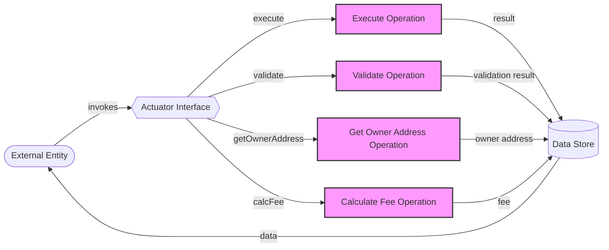

## Module: Actuator.java
- **模块名称**：Actuator.java

- **主要目标**：Actuator接口的目的是定义智能合约执行器的基本框架，包括执行、验证智能合约，获取合约所有者地址，以及计算费用等核心功能。

- **关键功能**：
  - `execute(Object result)`：执行智能合约，并返回执行结果。可能抛出`ContractExeException`异常。
  - `validate()`：验证智能合约的有效性，返回验证结果。可能抛出`ContractValidateException`异常。
  - `getOwnerAddress()`：获取智能合约所有者的地址，返回值为`ByteString`。可能抛出`InvalidProtocolBufferException`异常。
  - `calcFee()`：计算执行智能合约所需的费用，返回费用值。

- **关键变量**：由于Actuator是一个接口，因此它本身不直接定义变量。关键变量将在实现此接口的具体类中定义。

- **相互依赖性**：Actuator接口与系统中其他组件的相互作用主要通过接口方法的调用实现。它可能依赖于区块链系统中的账户模型、智能合约存储、费用计算等组件。

- **核心与辅助操作**：`execute`和`validate`方法构成了核心操作，因为它们直接关系到智能合约的执行与验证。`getOwnerAddress`和`calcFee`可视为辅助操作，它们提供了执行智能合约所需的额外信息。

- **操作序列**：在智能合约执行前，首先会调用`validate`方法进行验证；验证通过后，通过`execute`方法执行合约；执行过程中，可能会调用`getOwnerAddress`获取合约所有者地址，`calcFee`计算执行费用。

- **性能方面**：性能考虑可能包括方法执行的时间复杂度、资源消耗等。实现Actuator接口的类需要优化这些操作以确保高效的智能合约执行。

- **可重用性**：Actuator接口的设计使得不同类型的智能合约执行器可以通过实现此接口来统一接口规范，增强了代码的可重用性和模块化。

- **使用**：在区块链系统中，当需要执行或验证智能合约时，将通过创建实现了Actuator接口的类的实例来完成这些操作。

- **假设**：实现Actuator接口的类假设智能合约已经部署在区块链上，并且合约的格式和数据符合特定的标准。此外，还假设系统提供了足够的信息和资源来执行和验证智能合约。
## Flow Diagram [via mermaid]

