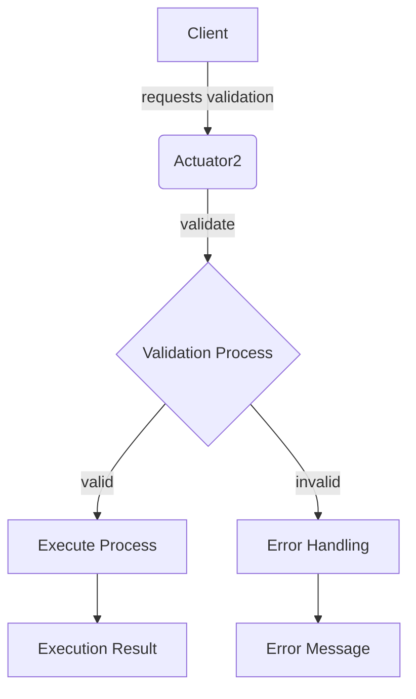

## Module: Actuator2.java
由于您提供的信息是关于一个Java接口的定义，我将根据这个接口提供的信息来生成分析。

- **模块名称**：Actuator2.java

- **主要目标**：这个接口的目的是为了定义一个执行器的标准，它规定了执行合约和验证合约的方法。这在区块链系统中通常用于处理智能合约的执行和验证。

- **关键功能**：
  - `execute(Object object)`：这个方法负责执行合约逻辑，它接受一个对象作为参数。如果执行过程中出现问题，会抛出`ContractExeException`异常。
  - `validate(Object object)`：这个方法用于在执行合约前验证合约的有效性，它同样接受一个对象作为参数。如果验证失败，会抛出`ContractValidateException`异常。

- **关键变量**：由于这是一个接口，它本身不直接定义变量，但它定义了方法参数的类型（Object），这意呈现了它可以处理的数据类型的通用性。

- **相互依赖性**：这个接口可能会与系统中负责合约管理的其他组件相互作用，例如合约的部署和调用机制，以及异常处理机制。

- **核心与辅助操作**：在这个接口中，`execute`和`validate`方法都是核心操作，因为它们直接关系到合约的执行和验证过程。

- **操作序列**：在实际使用中，通常首先调用`validate`方法进行合约验证，验证通过后再调用`execute`方法执行合约。

- **性能方面**：性能考虑可能包括方法执行的效率，以及如何优化以处理大量的合约执行请求。这可能依赖于具体实现的细节。

- **可重用性**：作为一个接口，Actuator2被设计为高度可重用，允许不同的合约执行器实现这个接口，从而在不同的上下文中复用执行和验证逻辑。

- **使用**：在区块链系统中，实现了Actuator2接口的类可以用于执行和验证各种智能合约，增加了系统处理合约的灵活性和扩展性。

- **假设**：设计这个接口的一个假设是，所有需要执行和验证的合约都可以通过一个统一的方法接口进行处理，即使它们的具体逻辑可能大相径庭。此外，还假设了合约执行和验证过程中可能出现的异常可以通过定义的异常类型进行有效管理。

这个分析基于您提供的接口定义，具体实现细节可能会进一步影响上述分析的各个方面。
## Flow Diagram [via mermaid]

