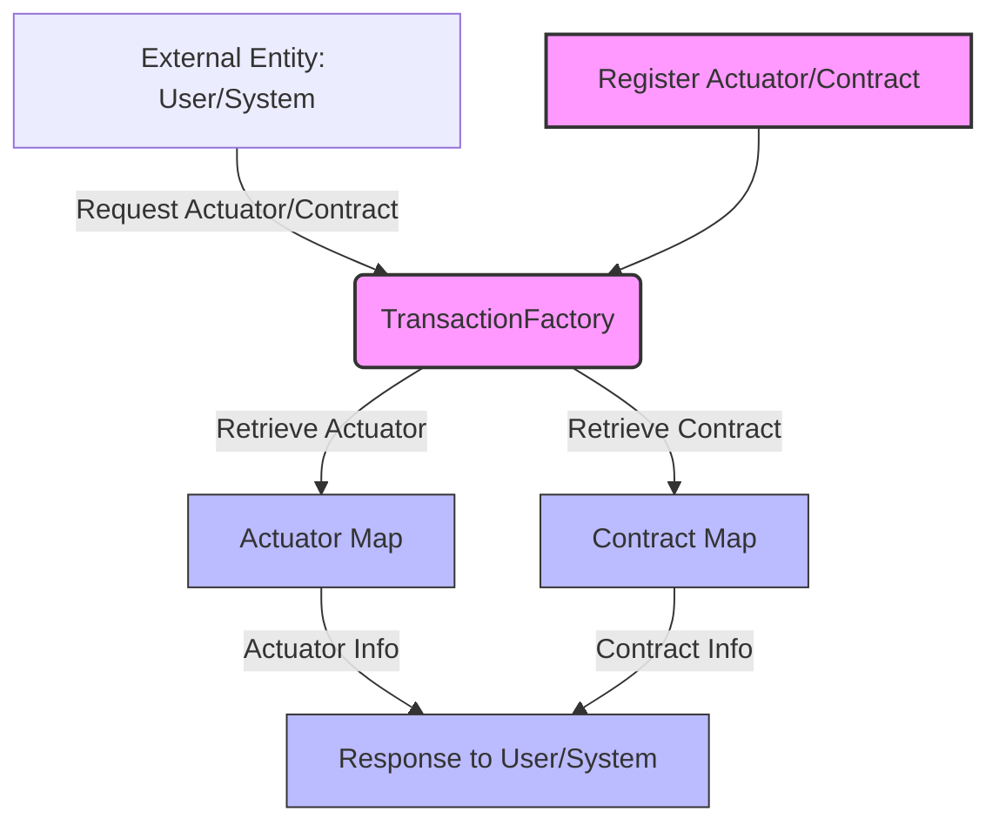

## Module: TransactionFactory.java
根据提供的代码模块，以下是用中文进行的综合分析：

- **模块名称**：TransactionFactory.java

- **主要目的**：此模块的主要目的是管理和维护区块链交易中使用的执行器（Actuator）和合约（Contract）类型的映射关系。它允许动态注册不同类型的交易执行器和合约，以支持不同类型的区块链交易。

- **关键功能**：
  - `register`：注册特定类型的交易执行器和合约类。这是实现动态添加交易处理能力的关键方法。
  - `getActuator`：根据交易类型获取对应的执行器类。
  - `getContract`：根据交易类型获取对应的合约类。
  - `getActuatorMap`和`getContractMap`：分别获取当前注册的所有执行器和合约类的映射关系。

- **关键变量**：
  - `actuatorMap`：存储合约类型与执行器类的映射关系。
  - `contractMap`：存储合约类型与合约消息类的映射关系。

- **交互依赖**：此模块与系统中的其他组件（如交易处理逻辑）紧密相连，通过提供执行器和合约类的映射关系，支持交易的处理和执行。

- **核心与辅助操作**：核心操作包括执行器和合约类的注册与获取，而辅助操作可能包括映射关系的管理和更新。

- **操作序列**：首先通过`register`方法注册执行器和合约类，然后在需要时通过`getActuator`和`getContract`方法获取相应的类。

- **性能方面**：考虑到`ConcurrentHashMap`的使用，此模块应能够高效地处理并发访问和更新操作，从而支持高性能的交易处理。

- **可重用性**：通过提供一种灵活的注册和获取机制，此模块具有很高的可重用性，可以轻松适应不同类型的交易和合约需求。

- **使用**：在区块链系统中，此模块被用于动态管理不同类型的交易执行器和合约，以支持各种交易的处理和执行。

- **假设**：假设所有注册的执行器和合约类都是有效的，并且系统中存在一个全局的`CommonParameter`实例来管理激活的执行器集合。

这个分析基于代码的静态查看，实际使用中还需考虑与系统其他部分的动态交互和集成。
## Flow Diagram [via mermaid]

