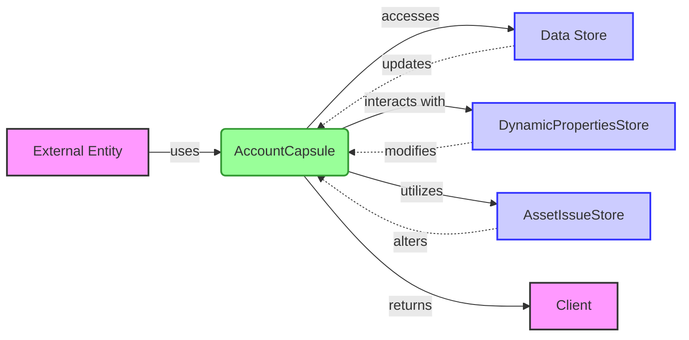

## Module: AccountCapsule.java
由于提供的代码非常长且复杂，我将尽力提供一个简洁的分析概要。请注意，这将是一个高层次的概述。

- **模块名称**：AccountCapsule.java

- **主要目标**：此模块的目的是提供一个封装了Tron区块链账户数据的类，包括账户的基本信息、余额、权限、投票等。

- **关键函数**：
  - 构造函数：初始化账户数据。
  - `setBalance`、`getBalance`：设置和获取账户余额。
  - `addVotes`、`getVotesList`：添加投票并获取投票列表。
  - `setAssetIssuedName`、`getAssetIssuedName`：设置和获取发行资产的名称。
  - `addAssetAmount`、`reduceAssetAmount`：增加或减少特定资产的数量。
  - 权限管理相关方法：包括设置和获取所有者、活动和见证人权限。

- **关键变量**：
  - `account`：存储账户的Protocol.Account对象。
  - `flag`：标志位，用于控制资产导入操作。

- **相互依赖性**：
  - 与`DynamicPropertiesStore`、`AssetIssueStore`等存储类有交互，用于管理动态属性和资产发行相关的数据。

- **核心与辅助操作**：
  - 核心操作：账户信息的管理（如余额、权限设置）和资产操作（如增加、减少资产）。
  - 辅助操作：资产导入、权限创建等。

- **操作序列**：
  - 类的实例化 -> 初始化账户数据 -> 执行特定操作（如资产管理、权限管理）。

- **性能方面**：
  - 性能考虑可能包括数据存储和访问效率，特别是在处理大量资产或频繁权限变更时。

- **可重用性**：
  - 此类设计为可重用，可以在不同的上下文中管理账户数据，例如在交易处理或账户更新中。

- **使用情况**：
  - 用于Tron区块链系统中账户数据的管理和操作，如创建新账户、更新账户信息、管理资产和投票等。

- **假设**：
  - 假设所有传入的数据都是有效的，并且在调用方法前已进行了必要的验证。

这个分析提供了一个关于`AccountCapsule.java`模块的概览，包括其目的、关键功能和操作等。希望这对您有所帮助。
## Flow Diagram [via mermaid]

