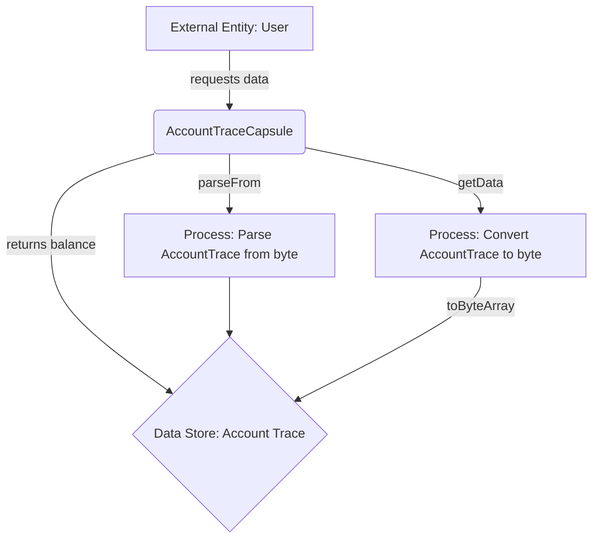

## Module: AccountTraceCapsule.java
**模块名称**：AccountTraceCapsule.java

**主要目标**：该模块的目的是封装和管理账户跟踪信息，允许对账户余额的跟踪和操作。

**关键功能**：
- 构造函数：提供了几种构造方法，允许从余额、AccountTrace对象或字节数组创建实例。
- `getBalance()`：获取账户的余额。
- `getData()`：获取序列化的AccountTrace数据，用于网络传输或存储。
- `getInstance()`：返回当前的AccountTrace实例。

**关键变量**：
- `accountTrace`：BalanceContract.AccountTrace类型，存储账户跟踪信息。

**相互依赖**：该模块依赖于`BalanceContract`，这是一个外部定义的协议缓冲区（protobuf）数据结构，用于定义账户跟踪的数据结构。

**核心与辅助操作**：
- 核心操作包括管理账户余额的跟踪信息，如获取和设置余额。
- 辅助操作包括实例的序列化和反序列化，这些是为了数据的持久化和网络传输。

**操作序列**：首先，通过构造函数创建实例，然后可以通过`getBalance()`获取余额，通过`getData()`获取序列化数据，通过`getInstance()`获取AccountTrace实例。

**性能方面**：性能考虑包括了序列化和反序列化的效率，以及在操作账户跟踪信息时的内存管理。

**可重用性**：该模块设计为可重用，可以在不同的上下文中用于管理和跟踪账户余额。

**使用**：主要用于Tron区块链平台内部，用于跟踪和管理账户余额变化。

**假设**：假设外部提供的`BalanceContract`协议缓冲区定义是正确的，并且输入数据（如字节数组）是有效的，不会导致解析异常。

这个分析基于提供的代码片段，旨在提供一个全面的概述。
## Flow Diagram [via mermaid]

