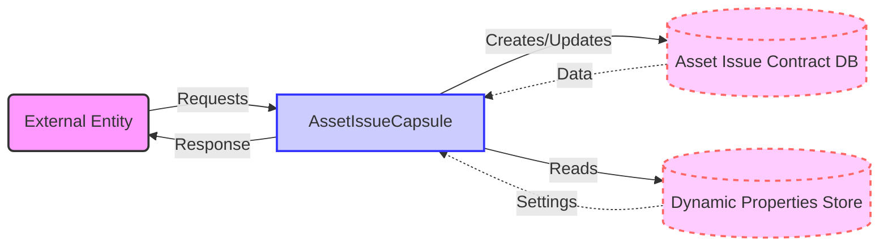

## Module: AssetIssueCapsule.java
根据提供的代码模块，以下是用中文进行的综合分析：

- **模块名称**：AssetIssueCapsule.java
- **主要目标**：该模块的目的是提供一个处理资产发行合约的功能封装，以便在java-tron系统中使用。
- **关键函数**：
  - `AssetIssueCapsule(byte[] data)`：从字节数据中获取资产发行合约。
  - `getInstance()`：返回当前的资产发行合约实例。
  - `getData()`：将资产发行合约转换为字节数据。
  - `createDbKey()`、`createDbV2Key()` 和 `createDbKeyFinal(DynamicPropertiesStore dynamicPropertiesStore)`：生成数据库键值。
  - `setPrecision(int precision)` 和 `getPrecision()`：设置和获取资产精度。
  - `setOrder(long order)` 和 `getOrder()`：设置和获取资产顺序。
  - `getFrozenSupplyList()` 和 `getFrozenSupply()`：获取冻结供应列表和总冻结供应量。
  - `setFreeAssetNetLimit(long newLimit)` 和 `getFreeAssetNetLimit()`：设置和获取自由资产网络限制。
- **关键变量**：
  - `assetIssueContract`：存储资产发行合约的实例。
- **相互依赖性**：该模块与`DynamicPropertiesStore`（动态属性存储）组件交互，用于处理不同版本的数据库键生成逻辑。
- **核心与辅助操作**：核心操作包括资产发行合约的创建、数据获取和设置。辅助操作包括数据库键的生成和管理。
- **操作序列**：首先，通过构造函数创建一个资产发行封装实例。然后，可以调用各种方法来修改或获取合约的属性。最后，可以将合约数据保存到数据库。
- **性能方面**：性能考虑包括有效地解析和生成字节数据，以及优化数据库键的生成过程。
- **可重用性**：该模块设计为可重用的，可以在需要处理资产发行合约的不同部分的java-tron系统中使用。
- **使用**：主要用于java-tron系统中资产发行的管理和操作，包括资产的创建、修改和查询。
- **假设**：假设输入的数据格式正确，并且系统配置允许对相应的资产进行操作。

这个分析提供了对`AssetIssueCapsule.java`模块的全面理解，包括它的目的、主要功能、以及如何在java-tron系统中使用。
## Flow Diagram [via mermaid]

