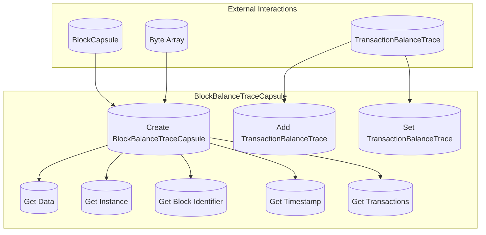

## Module: BlockBalanceTraceCapsule.java
- **模块名称**：BlockBalanceTraceCapsule.java

- **主要目标**：该模块的目的是封装区块余额跟踪信息，便于管理和访问与特定区块相关的余额变动信息。

- **关键函数**：
  - `BlockBalanceTraceCapsule()`：构造函数，初始化一个空的BlockBalanceTrace实例。
  - `BlockBalanceTraceCapsule(BlockCapsule blockCapsule)`：根据给定的区块信息构造BlockBalanceTrace实例。
  - `BlockBalanceTraceCapsule(byte[] data)`：通过解析字节数据来构造BlockBalanceTrace实例。
  - `addTransactionBalanceTrace(TransactionBalanceTrace transactionBalanceTrace)`：向BlockBalanceTrace中添加一个交易余额跟踪。
  - `setTransactionBalanceTrace(int index, TransactionBalanceTrace transactionBalanceTrace)`：设置指定索引处的交易余额跟踪。
  - `getData()`：获取该实例的字节数据表示。
  - `getInstance()`：返回BlockBalanceTrace实例。
  - `getBlockIdentifier()`：获取区块标识符。
  - `getTimestamp()`：获取时间戳。
  - `getTransactions()`：获取所有交易余额跟踪记录。

- **关键变量**：
  - `private BlockBalanceTrace balanceTrace`：存储区块余额跟踪信息的变量。

- **相互依赖性**：该模块依赖于`BlockCapsule`模块来获取区块信息，并使用`TransactionBalanceTrace`来记录交易余额的变动。

- **核心与辅助操作**：核心操作包括管理和访问区块余额跟踪信息，如添加和设置交易余额跟踪。辅助操作包括获取区块标识符、时间戳和交易列表。

- **操作序列**：首先通过构造函数初始化BlockBalanceTrace实例，然后可以添加或设置交易余额跟踪，最后可以获取相关信息如区块标识符、时间戳和交易列表。

- **性能方面**：性能考虑主要涉及到从字节数据解析BlockBalanceTrace实例的效率，以及管理交易余额跟踪记录的数据结构的效率。

- **可重用性**：该模块设计为通用的区块余额跟踪封装，可以在需要管理区块余额跟踪信息的不同场景下重用。

- **使用**：该模块可用于区块链系统中，需要跟踪和管理区块及其包含的交易对余额影响的场景。

- **假设**：假设输入的区块和交易信息是有效和正确的，且在解析字节数据时不会遇到无效的协议缓冲区异常。
## Flow Diagram [via mermaid]

