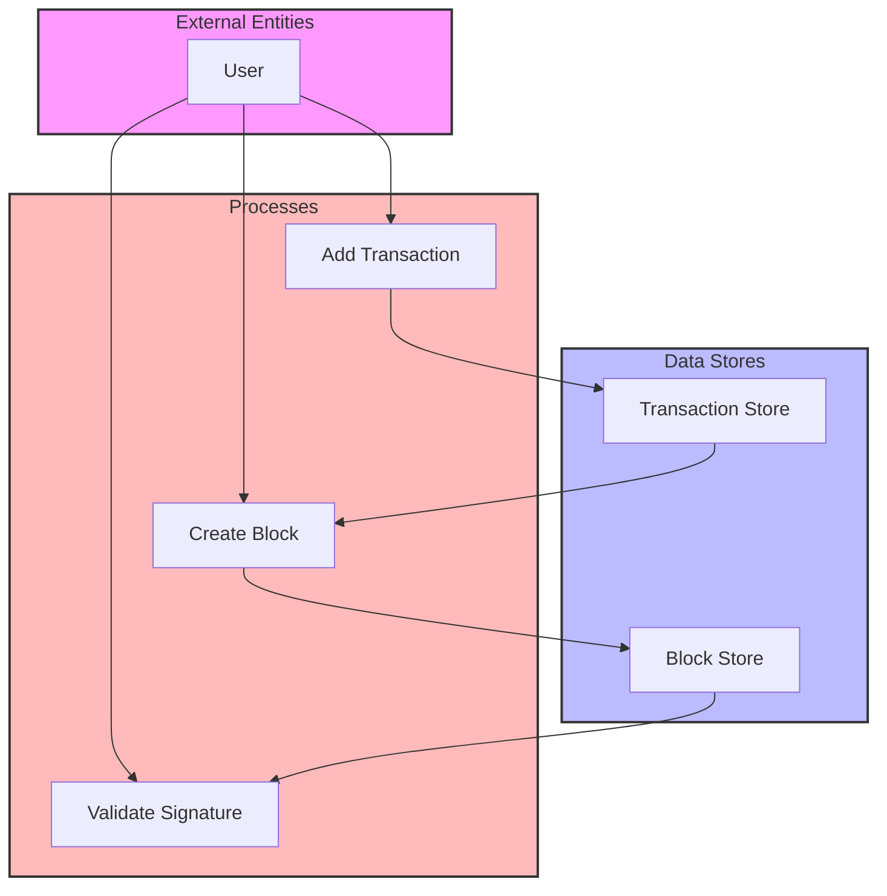

## Module: BlockCapsule.java
根据提供的代码模块，以下是用中文进行的综合分析：

- **模块名称**：BlockCapsule.java
- **主要目标**：该模块的目的是定义和处理区块链中的区块数据结构，包括区块的创建、区块内交易的处理以及区块的签名和验证等功能。
- **关键函数**：
  - `BlockCapsule(long number, Sha256Hash hash, long when, ByteString witnessAddress)` 和 `BlockCapsule(long timestamp, ByteString parentHash, long number, List<Transaction> transactionList)`：构造函数，用于初始化区块。
  - `addTransaction(TransactionCapsule pendingTrx)` 和 `addAllTransactions(List<TransactionCapsule> pendingTrxs)`：添加单个或多个交易到区块中。
  - `sign(byte[] privateKey)`：对区块进行签名。
  - `validateSignature(DynamicPropertiesStore dynamicPropertiesStore, AccountStore accountStore)`：验证区块签名的有效性。
  - `calcMerkleRoot()` 和 `setMerkleRoot()`：计算并设置默克尔树根。
  - `getBlockId()` 和 `getParentBlockId()`：获取当前区块的ID和父区块的ID。
- **关键变量**：
  - `private Block block`：存储区块的实际数据。
  - `private List<TransactionCapsule> transactions`：存储区块中的交易数据。
  - `private Bloom bloom`：布隆过滤器，用于快速检查元素是否存在。
- **交互依赖**：该模块与系统的其他组件如交易处理（TransactionCapsule）、加密签名（SignInterface）、动态属性存储（DynamicPropertiesStore）和账户存储（AccountStore）等有密切的交互。
- **核心与辅助操作**：核心操作包括区块的创建、交易的添加和签名验证；辅助操作包括设置和获取区块的各种属性（如默克尔根、见证人地址等）。
- **操作序列**：首先通过构造函数初始化区块，然后可以添加交易，之后对区块进行签名，最后可以验证签名的有效性。
- **性能方面**：性能考虑包括如何高效地处理和验证大量的交易，以及如何快速生成和验证签名。
- **可重用性**：该模块设计为可重用的组件，可以用于不同的区块链项目中，只需少量修改或配置。
- **使用**：主要用于java-tron项目中处理区块链的区块数据。
- **假设**：假设所有传入的数据都是有效的，并且外部系统如动态属性存储和账户存储都是可用的。

这个分析提供了对BlockCapsule模块的全面了解，包括它的目的、关键功能和操作等方面。
## Flow Diagram [via mermaid]

