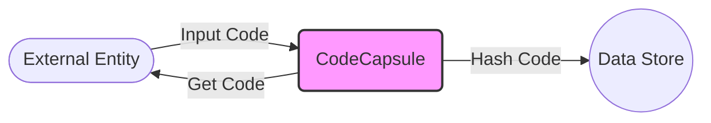

## Module: CodeCapsule.java
- **模块名称**: CodeCapsule

- **主要目标**: 该模块的目的是封装和处理与代码相关的数据，主要用于java-tron项目中，用于管理和操作智能合约代码。

- **关键功能**:
  - `CodeCapsule(byte[] code)`: 构造函数，用于初始化代码数据。
  - `getCodeHash()`: 获取代码的Sha256哈希值，这对于验证和比较代码的完整性非常重要。
  - `getData()`: 返回代码数据，允许其他组件访问原始代码。
  - `getInstance()`: 同样返回代码数据，强调了代码数据的可访问性。
  - `toString()`: 将代码数据转换为字符串表示，便于日志记录和调试。

- **关键变量**:
  - `byte[] code`: 存储智能合约的代码数据。

- **互依赖性**: 
  - 依赖于`org.tron.common.parameter.CommonParameter`和`org.tron.common.utils.Sha256Hash`来计算代码的哈希值，表明该模块与系统的其他部分（如参数配置和加密功能）有交互。

- **核心与辅助操作**:
  - 核心操作包括代码的存储、哈希计算和数据访问。
  - 辅助操作包括将代码数据转换为字符串的功能，主要用于日志记录和调试。

- **操作序列**:
  - 通常，首先通过构造函数初始化代码数据，然后可以通过`getCodeHash`、`getData`或`getInstance`方法访问此数据和其哈希值，`toString`方法用于调试。

- **性能方面**:
  - 性能考虑可能包括哈希计算的效率，以及如何高效地存储和访问较大的代码数据。

- **可重用性**:
  - 该模块设计为通用的代码封装组件，可以在需要处理代码数据的任何地方重用。

- **使用**:
  - 在java-tron项目中，用于封装智能合约代码，支持智能合约的部署和执行过程。

- **假设**:
  - 假设提供的代码数据是有效和合法的智能合约代码。
  - 假设系统配置（如加密引擎的选择）对于哈希计算是适当的。
## Flow Diagram [via mermaid]

