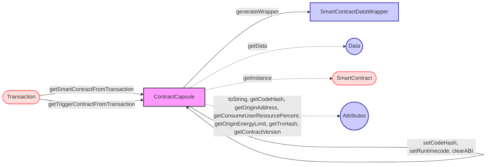

## Module: ContractCapsule.java
根据提供的代码模块，以下是用中文进行的综合分析：

- **模块名称**：ContractCapsule.java

- **主要目标**：该模块的目的是封装智能合约的数据和操作，提供智能合约数据的处理、存储和获取功能。

- **关键功能**：
  - 构造函数：初始化智能合约实例。
  - `getSmartContractFromTransaction`：从交易中提取创建智能合约的信息。
  - `getTriggerContractFromTransaction`：从交易中提取触发智能合约的信息。
  - `getCodeHash`、`setCodeHash`：获取和设置代码哈希。
  - `setRuntimecode`：设置运行时代码。
  - `generateWrapper`：生成包含智能合约和运行时代码的包装器。
  - `getData`、`getInstance`：获取智能合约的数据和实例。
  - `getOriginAddress`、`getConsumeUserResourcePercent`、`getOriginEnergyLimit`：获取智能合约的原始地址、用户资源消耗百分比和原始能量限制。
  - `clearABI`：清除ABI信息。
  - `getTrxHash`：获取交易哈希。
  - `getContractVersion`：获取合约版本。

- **关键变量**：
  - `smartContract`：存储智能合约的实例。
  - `runtimecode`：智能合约的运行时代码。

- **相互依赖关系**：该模块与系统的其他组件（如Transaction模块）交互，以从交易中提取智能合约信息或触发智能合约。

- **核心与辅助操作**：
  - 核心操作包括智能合约的数据处理和存取。
  - 辅助操作包括设置和获取智能合约的各种属性，如代码哈希、运行时代码等。

- **操作序列**：首先通过构造函数初始化智能合约实例，然后可以调用各种方法来设置或获取智能合约的属性，或者从交易中提取智能合约信息。

- **性能方面**：在处理大量智能合约或频繁访问智能合约属性时，性能考虑显得尤为重要。

- **可重用性**：该模块设计为通用的智能合约封装，可以在不同的智能合约处理场景中重用。

- **使用**：主要用于智能合约的创建、触发和信息获取等场景。

- **假设**：
  - 假设智能合约数据符合Tron智能合约协议的格式。
  - 假设交易数据中包含的智能合约信息是完整和有效的。
## Flow Diagram [via mermaid]

