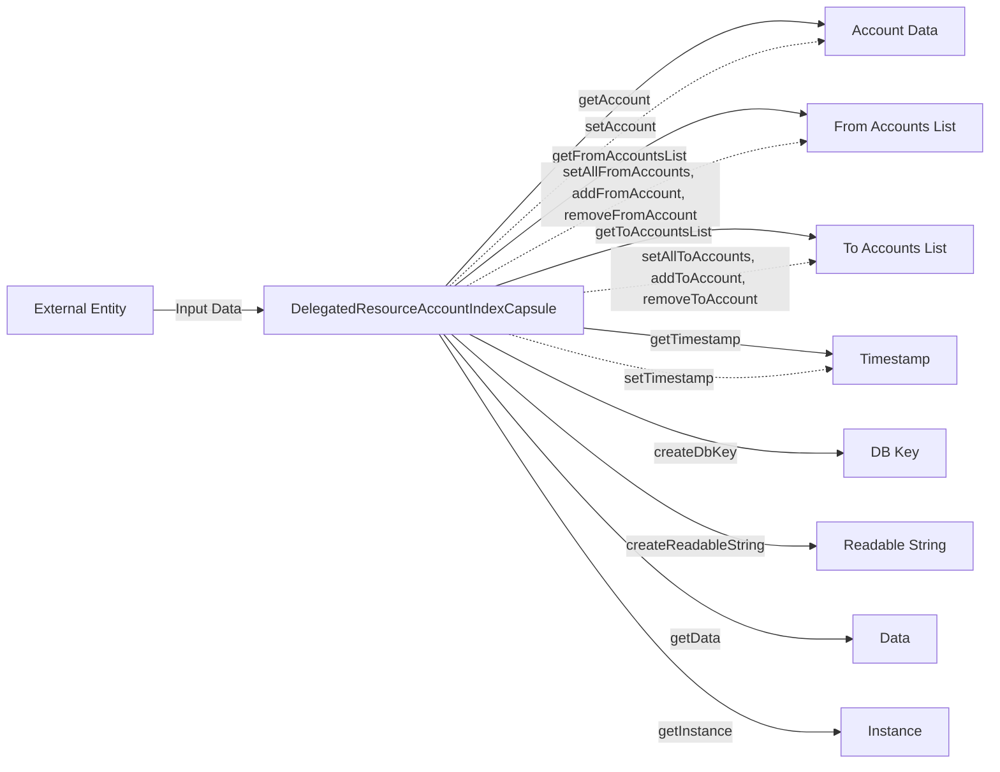

## Module: DelegatedResourceAccountIndexCapsule.java
- **模块名称**：DelegatedResourceAccountIndexCapsule.java

- **主要目标**：该模块的目的是提供一个封装了委托资源账户索引的类，用于管理和操作委托资源账户的索引信息。

- **关键函数**：
  - 构造函数：初始化DelegatedResourceAccountIndexCapsule实例。
  - getAccount：获取账户的ByteString表示。
  - setAccount：设置账户的ByteString表示。
  - getFromAccountsList：获取来源账户列表。
  - setAllFromAccounts：设置全部来源账户。
  - addFromAccount：向来源账户列表中添加一个账户。
  - removeFromAccount：从来源账户列表中移除一个账户。
  - getToAccountsList：获取目标账户列表。
  - setAllToAccounts：设置全部目标账户。
  - addToAccount：向目标账户列表中添加一个账户。
  - removeToAccount：从目标账户列表中移除一个账户。
  - setTimestamp：设置时间戳。
  - getTimestamp：获取时间戳。
  - createDbKey：创建数据库键。
  - createReadableString：创建可读字符串。
  - getData：获取数据的字节表示。
  - getInstance：获取DelegatedResourceAccountIndex实例。

- **关键变量**：
  - delegatedResourceAccountIndex：存储委托资源账户索引信息的DelegatedResourceAccountIndex实例。

- **互依赖性**：该模块依赖于Google的protobuf库进行数据的序列化和反序列化，以及org.tron.protos.Protocol中定义的DelegatedResourceAccountIndex协议。

- **核心操作与辅助操作**：
  - 核心操作：账户信息的设置与获取，来源账户和目标账户列表的管理。
  - 辅助操作：时间戳的设置与获取，数据库键和可读字符串的创建。

- **操作顺序**：通常先通过构造函数初始化实例，然后根据需要设置或修改账户信息以及来源和目标账户列表，最后可以获取时间戳或将信息序列化。

- **性能方面**：性能考虑主要在于protobuf的序列化和反序列化效率，以及列表操作的复杂度。

- **可重用性**：此类设计为可重用，可用于管理任何委托资源账户索引的场景。

- **使用**：在需要管理委托资源账户索引信息的地方使用，如在区块链系统中跟踪和管理账户之间的资源委托关系。

- **假设**：假设使用者熟悉protobuf和区块链中的资源委托概念。
## Flow Diagram [via mermaid]

