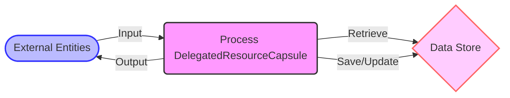

## Module: DelegatedResourceCapsule.java
根据提供的代码模块，以下是用中文进行的综合分析：

- **模块名称**：DelegatedResourceCapsule.java

- **主要目标**：该模块的目的是封装和处理委托资源数据，这些数据包括能量和带宽的冻结余额及其到期时间。

- **关键功能**：
  - 构造函数：初始化DelegatedResource实例。
  - `createDbKey` 和 `createDbKeyV2`：生成数据库键值。
  - `getFrom` 和 `getTo`：获取资源委托的发送者和接收者地址。
  - `getFrozenBalanceForEnergy` 和 `getFrozenBalanceForBandwidth`：获取能量和带宽的冻结余额。
  - `setFrozenBalanceForEnergy` 和 `setFrozenBalanceForBandwidth`：设置能量和带宽的冻结余额。
  - `addFrozenBalanceForEnergy` 和 `addFrozenBalanceForBandwidth`：增加能量和带宽的冻结余额。
  - `getExpireTimeForBandwidth` 和 `getExpireTimeForEnergy`：获取能量和带宽冻结余额的到期时间。
  - `setExpireTimeForBandwidth` 和 `setExpireTimeForEnergy`：设置能量和带宽冻结余额的到期时间。

- **关键变量**：
  - `V2_PREFIX` 和 `V2_LOCK_PREFIX`：用于数据库键值的前缀。
  - `delegatedResource`：存储委托资源数据的DelegatedResource实例。

- **相互依赖性**：该模块与系统的其他组件（如DynamicPropertiesStore）交互，以获取系统的动态属性，例如是否允许多重签名。

- **核心与辅助操作**：核心操作包括管理冻结余额和到期时间的设置与获取。辅助操作包括创建数据库键值和序列化/反序列化DelegatedResource实例。

- **操作顺序**：通常，首先通过构造函数或解析数据来初始化DelegatedResource实例，然后通过提供的方法管理冻结余额和到期时间。

- **性能方面**：性能考虑可能包括优化数据结构和访问模式以减少数据库操作的开销。

- **可重用性**：该模块设计为可重用，可以在需要处理委托资源数据的不同上下文中使用。

- **使用**：主要用于区块链系统中管理账户之间委托的能量和带宽资源，例如在TRON区块链平台上。

- **假设**：
  - 假设系统中存在有效的委托资源数据结构。
  - 假设调用者负责正确设置冻结余额和到期时间。

以上分析基于代码模块的内容和结构进行，旨在提供对该模块功能和作用的全面理解。
## Flow Diagram [via mermaid]

