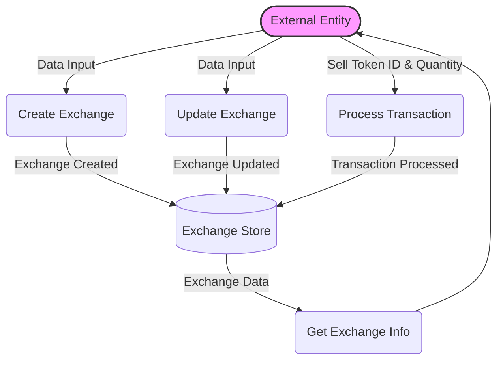

## Module: ExchangeCapsule.java
根据提供的代码模块，以下是用中文进行的综合分析：

- **模块名称**：ExchangeCapsule.java
- **主要目标**：定义交易所胶囊（ExchangeCapsule）的目的是为了封装和处理与交易所相关的数据和逻辑操作。
- **关键功能**：
  - 构造函数：初始化交易所数据。
  - `getID`、`setID`：获取和设置交易所ID。
  - `getCreatorAddress`、`setExchangeAddress`：获取和设置创建者地址。
  - `setBalance`：设置第一种和第二种代币的余额。
  - `getCreateTime`、`setCreateTime`：获取和设置创建时间。
  - `getFirstTokenId`、`setFirstTokenId`、`getSecondTokenId`、`setSecondTokenId`：获取和设置第一种和第二种代币的ID。
  - `getFirstTokenBalance`、`getSecondTokenBalance`：获取第一种和第二种代币的余额。
  - `createDbKey`：创建数据库键。
  - `transaction`：执行交易逻辑。
  - `resetTokenWithID`：重置代币ID。
- **关键变量**：
  - `exchange`：存储交易所的数据。
- **相互依赖性**：与`AssetIssueStore`和`DynamicPropertiesStore`等系统组件交互，用于处理代币信息和动态属性。
- **核心与辅助操作**：核心操作包括交易逻辑处理和代币余额的管理。辅助操作包括设置和获取各种属性。
- **操作序列**：首先通过构造函数初始化交易所数据，然后可以通过各种方法对数据进行操作和管理。
- **性能方面**：性能考虑可能包括如何有效地处理大量的交易请求和数据存储。
- **可重用性**：此模块设计为可重用，可以在不同的上下文中应用，只要交易所的基本逻辑和数据结构保持不变。
- **使用**：用于管理和处理交易所的数据，包括代币交易、余额管理等。
- **假设**：
  - 假设`AssetIssueStore`和`DynamicPropertiesStore`提供必要的代币信息和系统动态配置。
  - 假设所有输入数据都是有效和正确的，特别是在执行交易逻辑时。

这个分析基于代码的结构和功能提供了一个概览，具体实现细节和上下文使用可能会有所不同。
## Flow Diagram [via mermaid]

