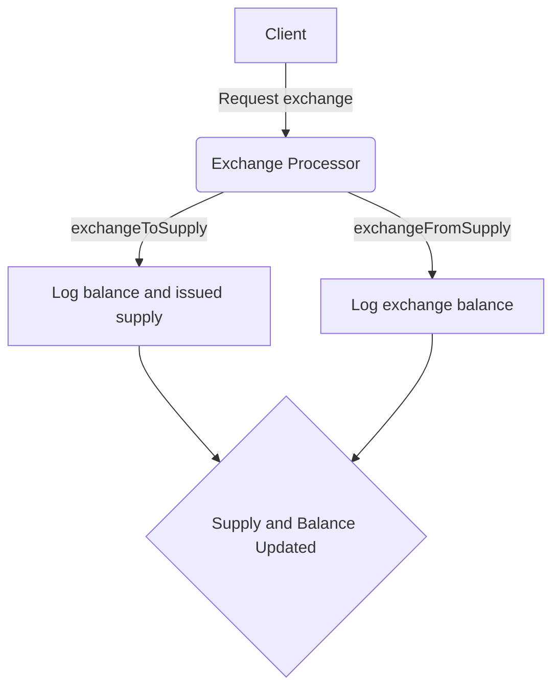

## Module: ExchangeProcessor.java
- **模块名称**：ExchangeProcessor.java

- **主要目的**：该模块的目的是处理交换操作，它通过计算供给和需求来调整代币之间的交换率。

- **关键功能**：
  - `exchangeToSupply(long balance, long quant)`：计算并更新供给量，根据当前余额和交易量计算新的供给量。
  - `exchangeFromSupply(long balance, long supplyQuant)`：根据供给量变化和当前余额，计算交换后的余额。
  - `exchange(long sellTokenBalance, long buyTokenBalance, long sellTokenQuant)`：执行交换操作，结合上述两个方法，计算出卖出代币和买入代币的最终余额。

- **关键变量**：
  - `supply`：代表当前的供给量，是交换过程中一个重要的动态变量。

- **互依赖性**：
  - 该模块可能依赖于其他系统组件来获取当前的代币余额信息，尽管代码示例中没有直接显示这些互动。

- **核心与辅助操作**：
  - 核心操作包括`exchangeToSupply`和`exchangeFromSupply`，它们直接参与计算交换率和更新供给量。
  - 辅助操作包括日志记录等，帮助监控和调试过程。

- **操作序列**：
  - 首先通过`exchangeToSupply`计算出给定量的代币交换后的供给量变化。
  - 然后，使用`exchangeFromSupply`根据这个供给量变化计算出交换后的余额。
  - 最后，`exchange`方法结合这两步来完成整个交换过程。

- **性能考虑**：
  - 性能可能受到复杂数学计算的影响，尤其是在处理大量交易时。
  - 日志记录可能会影响性能，尤其是在高日志级别下。

- **可重用性**：
  - 该模块的设计允许它在不同的交换场景中重用，只要适当调整供给量和余额参数即可。

- **使用**：
  - 该模块可用于任何需要代币交换功能的系统中，特别是在需要动态调整交换率的场景下。

- **假设**：
  - 假设供给量和余额参数是准确和最新的。
  - 假设交换操作遵循市场规则和数学模型的预期。
## Flow Diagram [via mermaid]

