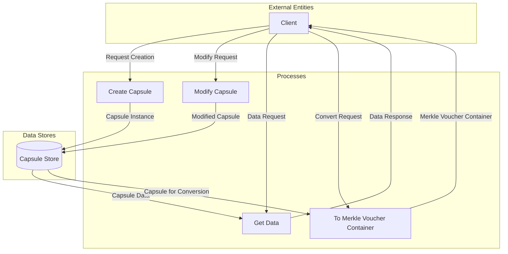

## Module: IncrementalMerkleVoucherCapsule.java
- **模块名称**：IncrementalMerkleVoucherCapsule.java

- **主要目标**：该模块的目的是封装增量默克尔凭证的数据结构和操作，以支持隐私保护交易的处理。

- **关键功能**：
  - 构造函数：初始化增量默克尔凭证。
  - `getTree`：获取当前的默克尔树。
  - `setTree`：设置新的默克尔树。
  - `getFilled`：获取已填充的Pedersen哈希列表。
  - `addFilled`：向凭证中添加一个已填充的Pedersen哈希。
  - `getCursor`和`setCursor`：获取和设置游标，指向当前处理的树节点。
  - `clearCursor`：清除游标。
  - `getCursorDepth`和`setCursorDepth`：获取和设置游标深度。
  - `resetRt`：重置根哈希。
  - `getOutputPoint`和`setOutputPoint`：获取和设置输出点。
  - `getData`和`getInstance`：获取凭证的字节数据和实例。

- **关键变量**：
  - `voucher`：存储增量默克尔凭证的实例。

- **交互依赖**：
  - 与`IncrementalMerkleTreeCapsule`类交互，用于管理默克尔树的操作。
  - 与`IncrementalMerkleVoucherContainer`类交互，用于处理凭证容器的操作。

- **核心与辅助操作**：
  - 核心操作包括管理默克尔树、游标和哈希值的添加、设置和获取。
  - 辅助操作包括重置根哈希、获取和设置输出点。

- **操作序列**：
  - 通常先通过构造函数初始化，然后通过`setTree`、`addFilled`等方法更新状态，最终通过`getData`或`getInstance`获取处理结果。

- **性能方面**：
  - 性能考虑主要集中在高效地管理和更新默克尔树结构上，以及最小化数据转换和处理的开销。

- **可重用性**：
  - 该模块设计为可重用，可以在处理不同的隐私保护交易时复用，减少了代码冗余。

- **使用**：
  - 用于支持隐私保护交易的处理，特别是在计算和验证增量默克尔树和凭证方面。

- **假设**：
  - 假设调用者熟悉默克尔树和Pedersen哈希的概念和操作。
  - 假设在处理隐私保护交易时，系统的其他部分能正确生成和提供必要的数据。
## Flow Diagram [via mermaid]

