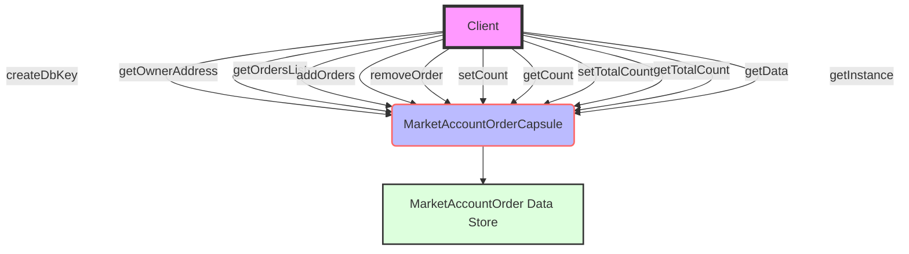

## Module: MarketAccountOrderCapsule.java
- **模块名称**：MarketAccountOrderCapsule.java

- **主要目标**：此模块的目的是封装与市场账户订单相关的操作，便于管理和访问市场账户的订单信息。

- **关键功能**：
  - 构造函数：提供多个构造函数，用于从不同数据源创建实例。
  - `getOwnerAddress`：获取订单所有者的地址。
  - `createDbKey`：基于所有者地址创建数据库键。
  - `getOrdersList`：获取当前所有订单的列表。
  - `addOrders`：向订单列表中添加新订单。
  - `removeOrder`：从订单列表中移除指定订单。
  - `setCount`和`getCount`：设置和获取订单数量。
  - `setTotalCount`和`getTotalCount`：设置和获取总订单数量。
  - `getData`和`getInstance`：分别用于获取序列化的订单数据和订单实例。

- **关键变量**：
  - `accountOrder`：MarketAccountOrder类型，存储市场账户的订单信息。

- **依赖性**：
  - 与`org.tron.protos.Protocol.MarketAccountOrder`类有直接依赖，用于订单信息的序列化和反序列化。
  - 依赖于Google的protobuf库进行数据的序列化。

- **核心与辅助操作**：
  - 核心操作包括订单的添加、移除以及订单数量的管理。
  - 辅助操作包括创建数据库键、获取序列化数据等。

- **操作序列**：
  - 通常，操作开始于通过构造函数创建实例，随后可以添加或移除订单，修改订单数量，最终可能需要序列化或获取实例的状态。

- **性能方面**：
  - 性能考虑主要集中在序列化和反序列化操作上，以及如何高效管理订单列表。

- **可重用性**：
  - 此模块设计为可重用组件，可以在需要管理市场账户订单的不同部分的系统中使用。

- **使用**：
  - 用于市场账户管理系统中，特别是需要跟踪和管理用户订单的场景。

- **假设**：
  - 假设所有传入的数据都是有效的，并且用户负责处理任何可能的异常情况。
  - 假设系统中存在有效的市场账户订单数据结构。
## Flow Diagram [via mermaid]

