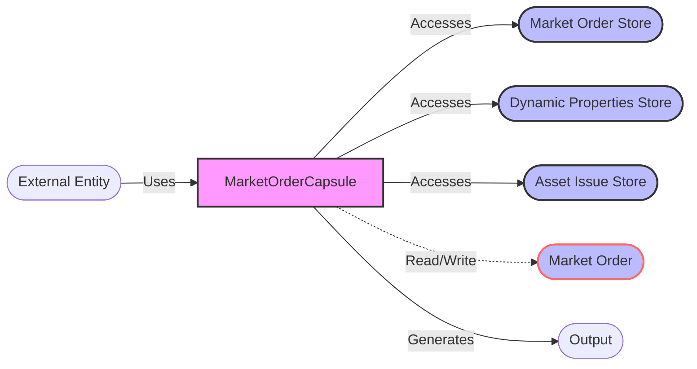

## Module: MarketOrderCapsule.java
- **模块名称**：MarketOrderCapsule.java

- **主要目标**：该模块的目的是封装市场订单的数据和操作，便于管理和访问市场订单的相关信息。

- **关键功能**：
  - 构造函数：用于创建市场订单胶囊的实例。
  - `getID`、`setID`：获取和设置订单ID。
  - `getOwnerAddress`、`setOwnerAddress`：获取和设置订单所有者的地址。
  - `getCreateTime`、`setCreateTime`：获取和设置订单的创建时间。
  - `getSellTokenId`、`setSellTokenId`：获取和设置卖方代币ID。
  - `getSellTokenQuantity`、`setSellTokenQuantity`：获取和设置卖方代币数量。
  - `getState`、`setState`：获取和设置订单状态。
  - `isActive`：检查订单是否处于活跃状态。
  - `getPrevCapsule`、`getNextCapsule`：获取前一个或下一个市场订单胶囊。

- **关键变量**：
  - `order`：存储市场订单的Protocol.MarketOrder实例。

- **相互依赖性**：
  - 与`MarketOrderStore`、`AssetIssueStore`和`DynamicPropertiesStore`等存储类相互作用，用于访问和更新市场订单相关的数据。

- **核心与辅助操作**：
  - 核心操作包括管理订单数据（如ID、所有者地址、代币ID和数量等）和订单状态。
  - 辅助操作包括检查订单是否活跃、获取前一个和下一个订单等。

- **操作序列**：
  - 创建订单胶囊实例 -> 设置或获取订单信息 -> 根据需要修改订单状态或信息 -> 与市场订单存储交互。

- **性能方面**：
  - 该模块应注意数据访问和更新的效率，特别是在与存储系统交互时。

- **可重用性**：
  - 该模块设计为可重用，可以在需要管理市场订单数据的不同场景中使用。

- **使用**：
  - 用于在TRON区块链系统中管理市场订单，如创建、查询和更新市场订单。

- **假设**：
  - 假设所有传入的数据都是有效的，并且外部存储系统（如市场订单存储）是可用的。

这是基于提供的代码模块的分析，旨在帮助理解其结构和功能。
## Flow Diagram [via mermaid]

