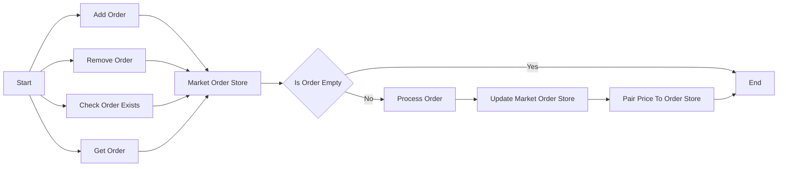

## Module: MarketOrderIdListCapsule.java
- **模块名称**：MarketOrderIdListCapsule.java

- **主要目标**：此模块的目的是管理市场订单ID列表，提供对订单列表的基本操作，如添加、删除、查询订单等。

- **关键功能**：
  - `isOrderExists`：检查特定订单ID是否存在于列表中。
  - `removeOrder`：从列表中移除特定的订单。
  - `addOrder`：向列表中添加新的订单。
  - `getHeadOrder`、`getOrderByIndex`：获取列表中的第一个订单或指定位置的订单。
  - `getOrderSize`：获取列表中订单的数量。
  - `getAllOrder`：获取列表中的所有订单，支持限制返回的订单数量。

- **关键变量**：
  - `orderIdList`：存储订单ID列表的变量。
  - `head`和`tail`：分别表示订单列表的头部和尾部。

- **相互依赖性**：
  - 与`MarketOrderStore`和`MarketPairPriceToOrderStore`有强依赖关系，用于存储和检索市场订单。

- **核心与辅助操作**：
  - 核心操作包括订单的添加、删除和查询。
  - 辅助操作包括设置头部和尾部、检查订单是否存在等。

- **操作序列**：
  - 添加订单时，会更新头部和尾部。
  - 删除订单时，需要处理头部和尾部的更新以及前后订单的连接。

- **性能方面**：
  - 性能考虑主要集中在有效管理订单列表，尤其是在列表较长时，如何高效地添加、删除和查询订单。

- **可重用性**：
  - 此模块设计为可重用，可以在需要管理订单ID列表的其他场景中使用。

- **使用**：
  - 在交易所或市场相关的系统中使用，用于管理订单的生命周期。

- **假设**：
  - 假设所有传入的订单ID都是有效的，并且在调用`removeOrder`和`addOrder`等方法前已经进行了必要的验证。
## Flow Diagram [via mermaid]

