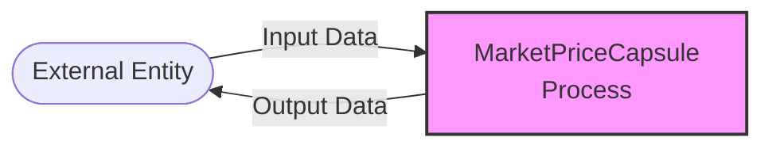

## Module: MarketPriceCapsule.java
基于提供的代码模块，以下是以中文进行的综合分析：

- **模块名称**：MarketPriceCapsule.java
- **主要目标**：此模块的目的是封装市场价格信息，包括卖出代币数量和购买代币数量，以便于在系统中进行交易价格的管理和查询。
- **关键函数**：
  - `MarketPriceCapsule()`：构造函数，用于初始化市场价格实例。
  - `getSellTokenQuantity()`：获取卖出代币的数量。
  - `setSellTokenQuantity(long sellTokenQuantity)`：设置卖出代币的数量。
  - `getBuyTokenQuantity()`：获取购买代币的数量。
  - `setBuyTokenQuantity(long value)`：设置购买代币的数量。
  - `getKey(byte[] sellTokenId, byte[] buyTokenId)`：根据卖出和购买代币的ID生成市场价格的键值。
  - `isNull()`：检查市场价格是否为空（即卖出和购买代币数量都为0）。
  - `getData()`：获取市场价格的字节数据。
  - `getInstance()`：获取市场价格实例。
- **关键变量**：
  - `price`：MarketPrice类型，存储卖出和购买代币的数量信息。
- **相互依赖性**：此模块依赖于`MarketUtils`工具类来创建市场价格键值，同时也依赖于Google的Protocol Buffers来序列化和反序列化市场价格信息。
- **核心与辅助操作**：核心操作包括设置和获取代币数量，以及序列化市场价格信息。辅助操作包括生成市场价格的键值和检查市场价格是否为空。
- **操作序列**：首先通过构造函数初始化市场价格，然后可以通过相应的setter和getter方法设置和获取代币数量，最后可以通过`getData()`方法获取序列化的市场价格信息。
- **性能方面**：考虑到性能，此模块使用了Protocol Buffers进行数据的序列化和反序列化，以减少数据传输的大小并提高效率。
- **可重用性**：此模块设计为可重用的，可以在需要管理和查询市场价格信息的不同场景中使用。
- **使用**：此模块主要用于加密货币交易系统中，用于管理和查询不同代币交易对的市场价格。
- **假设**：假设所有传入的代币数量都是有效的，且在使用`getKey`方法生成键值时，卖出和购买代币的ID已知且有效。

以上是基于提供的代码模块的综合分析，旨在帮助理解其结构和功能。
## Flow Diagram [via mermaid]

