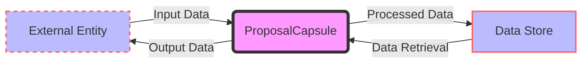

## Module: ProposalCapsule.java
根据提供的代码模块，以下是用中文进行的综合分析：

- **模块名称**：ProposalCapsule.java

- **主要目标**：该模块的目的是定义、管理和操作提案（Proposal）数据结构，以支持区块链网络中的提案创建、审批和状态管理等功能。

- **关键功能**：
  - 构造函数：用于初始化提案实例。
  - `getID/setID`：获取或设置提案的ID。
  - `getProposalAddress/setProposalAddress`：获取或设置提案发起者的地址。
  - `getParameters/setParameters`：获取或设置提案的参数。
  - `getExpirationTime/setExpirationTime` 和 `getCreateTime/setCreateTime`：获取或设置提案的过期时间和创建时间。
  - `addApproval/removeApproval/clearApproval`：管理提案的批准情况。
  - `getState/setState`：获取或设置提案的状态。
  - `hasProcessed/hasCanceled/hasExpired`：检查提案是否已处理、取消或过期。
  - `hasMostApprovals`：判断提案是否获得了大多数见证人的批准。

- **关键变量**：
  - `proposal`：存储提案数据的核心变量。
  - `MAX_ACTIVE_WITNESS_NUM`：活跃见证人的最大数量，用于计算提案批准的阈值。

- **互相依赖**：该模块依赖于`org.tron.protos.Protocol`中的`Proposal`数据结构，以及对`ByteString`和`Map<Long, Long>`等数据类型的操作。此外，还依赖于`org.tron.common.utils.WalletUtil`中的`getAddressStringList`方法来处理地址列表。

- **核心与辅助操作**：核心操作包括提案的创建、参数设置、状态管理和批准管理。辅助操作包括对提案ID和地址的获取与设置，以及检查提案的状态（如是否过期、是否被批准等）。

- **操作序列**：通常，操作序列从创建提案开始，然后设置提案的参数和状态，随后进行批准管理，最后根据提案的状态执行相应的操作（如计算是否获得大多数批准）。

- **性能方面**：考虑到性能，重要的是优化提案状态的查询和更新，以及批准列表的管理，特别是在有大量活跃见证人和提案时。

- **可重用性**：该模块设计为可重用，可用于不同的提案类型和场景，通过参数和状态的灵活管理来适应不同的需求。

- **使用**：在区块链网络中，当需要创建、审批或管理提案时，会使用到此模块。它是提案生命周期管理的关键组成部分。

- **假设**：
  - 网络中存在一定数量的活跃见证人。
  - 提案的参数和状态管理遵循特定的规则和约定。

以上是根据提供的代码模块进行的分析。
## Flow Diagram [via mermaid]

