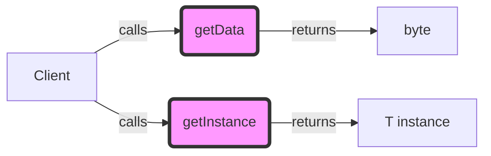

## Module: ProtoCapsule.java
- **模块名称**: ProtoCapsule.java

- **主要目的**: ProtoCapsule.java 是一个接口，定义了与“原型胶囊”相关的基本操作。其目的是为了提供一个标准化的方式来处理数据的序列化和反序列化，以及获取数据实例。

- **关键功能**:
  - `byte[] getData()`: 此方法用于获取原始数据的字节数组。这是序列化数据的基本形式。
  - `T getInstance()`: 此方法用于获取数据的实例。它返回一个泛型类型 `T`，表示具体的数据实例。

- **关键变量**: 由于ProtoCapsule是一个接口，它本身不直接定义变量，但关键在于实现此接口的类将会具有处理数据实例和序列化数据的变量。

- **相互依赖性**: ProtoCapsule接口依赖于实现它的具体类来具体化数据处理逻辑。同时，它可能与系统中负责数据存储、网络传输等其他组件交互，以便序列化数据的存储和传输。

- **核心与辅助操作**: 核心操作包括数据的序列化（通过`getData()`方法）和反序列化（通过`getInstance()`方法）。辅助操作可能包括与数据处理相关的任何其他辅助方法，但这些将在具体实现中定义。

- **操作序列**: 在使用ProtoCapsule接口的场景中，一般首先通过实现类创建数据的实例，然后通过`getData()`方法序列化这些数据，最后可能通过`getInstance()`方法从序列化的数据中恢复实例。

- **性能方面**: 性能考虑可能包括序列化和反序列化的效率，以及这些操作对内存和存储的影响。实现此接口的类需要优化这些操作以确保高效性能。

- **可重用性**: ProtoCapsule接口的设计允许高度的重用性，因为它提供了一组标准的操作，可以在不同的上下文中实现和使用，适用于多种数据类型的序列化和反序列化。

- **使用**: 此接口被用于在需要序列化和反序列化数据的组件中。通过实现ProtoCapsule，开发者可以创建能够以标准方式处理不同数据类型的类。

- **假设**: 实现ProtoCapsule接口的类假设数据可以被序列化为字节数组，并且从这些字节数组中可以恢复原始数据的准确实例。此外，还假设实现类能够有效地处理序列化和反序列化操作，无论数据大小如何。
## Flow Diagram [via mermaid]

