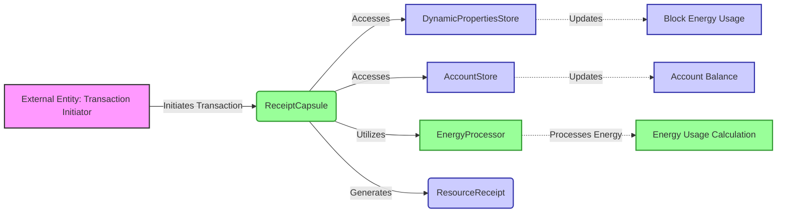

## Module: ReceiptCapsule.java
基于提供的代码模块，以下是其全面分析：

- **模块名称**：ReceiptCapsule.java

- **主要目标**：该模块的目的是处理与Tron区块链交易相关的资源收据，包括能量使用、网络使用费用等。

- **关键功能**：
  - `addNetFee(long netFee)`：添加网络使用费用。
  - `payEnergyBill`：根据交易处理支付能量费用。
  - `setEnergyUsage`、`setEnergyFee`、`setOriginEnergyUsage`等：设置相关能量使用和费用。
  - `getEnergyUsage`、`getEnergyFee`、`getOriginEnergyUsage`等：获取相关能量使用和费用。

- **关键变量**：
  - `ResourceReceipt receipt`：资源收据，存储能量使用、网络使用等信息。
  - `Sha256Hash receiptAddress`：收据地址，标识收据。
  - `long multiSignFee`、`long memoFee`：多签名费用和备忘录费用。
  - `long originEnergyLeft`、`long callerEnergyLeft`：合约部署者和调用者在执行交易前的可用能量。

- **相互依赖性**：与`DynamicPropertiesStore`、`AccountStore`、`ForkController`、`EnergyProcessor`等其他系统组件交互，用于处理动态属性、账户信息、分叉控制和能量处理。

- **核心操作与辅助操作**：
  - 核心操作包括处理能量费用、设置和获取能量使用和费用。
  - 辅助操作可能包括与其他系统组件的交互，如动态属性和账户信息的更新。

- **操作序列**：首先，根据交易的类型和执行结果，计算能量使用和网络费用。然后，根据账户的可用能量和系统的当前规则，支付能量费用。

- **性能方面**：考虑到能量和网络费用的计算和支付需要高效处理，以不影响交易执行的速度和系统的整体性能。

- **可重用性**：此模块设计为可在Tron区块链系统中广泛重用，处理各种交易的资源收据。

- **使用**：主要用于Tron区块链的交易处理，特别是在执行智能合约时计算和支付能量和网络费用。

- **假设**：
  - 假设系统的其他组件（如`DynamicPropertiesStore`、`AccountStore`）正常工作，能提供所需的数据和功能。
  - 假设交易的信息（如能量使用、网络使用）是准确的，可以用于计算费用。

这个分析提供了对`ReceiptCapsule`模块功能和用途的深入理解，强调了其在Tron区块链交易处理中的重要性。
## Flow Diagram [via mermaid]

