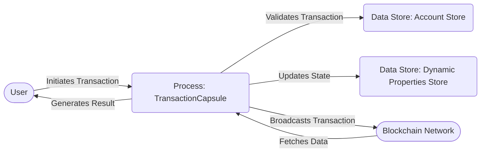

## Module: TransactionCapsule.java
由于您提供的代码很长且详细，我将基于这个`TransactionCapsule.java`模块的概要信息，进行简化的分析。请注意，这将是一个基于代码摘要的分析，并不会涵盖所有细节。

- **模块名称**：TransactionCapsule.java

- **主要目标**：该模块的目的是封装和处理与交易相关的逻辑，包括交易的创建、验证、签名等功能。

- **关键函数**：
  - `TransactionCapsule`：构造函数，用于创建交易实例。
  - `sign`：对交易进行签名。
  - `validateSignature`：验证交易的签名。
  - `getTransactionId`：获取交易的ID。
  - `setResult`和`setResultCode`：设置交易结果。
  - `isContractType`：检查是否为智能合约交易。

- **关键变量**：
  - `transaction`：存储交易的主体信息。
  - `blockNum`和`time`：交易相关的区块编号和时间戳。
  - `id`：交易的哈希ID。
  - `isVerified`：标记交易是否已验证。

- **依赖关系**：
  - 与`AccountStore`、`DynamicPropertiesStore`等其他系统组件有交互，用于访问账户信息和动态属性。
  - 依赖于`SignUtils`等加密工具类进行签名和验证。

- **核心与辅助操作**：
  - 核心操作包括交易的创建、签名、验证。
  - 辅助操作可能包括设置和获取交易的各种属性，如时间戳、结果等。

- **操作序列**：
  - 通常，操作序列开始于交易的创建，随后是签名、验证，最后是执行或广播。

- **性能方面**：
  - 性能考虑可能包括签名和验证的效率，以及交易数据结构的优化。

- **可重用性**：
  - 该模块设计用于处理各种类型的交易，具有较高的可重用性。

- **使用**：
  - 在构建和处理区块链网络中的交易时使用。

- **假设**：
  - 假设交易数据格式正确且符合预期的协议标准。

请注意，这只是基于您提供的代码概要的分析。具体实现细节可能会有所不同。
## Flow Diagram [via mermaid]

