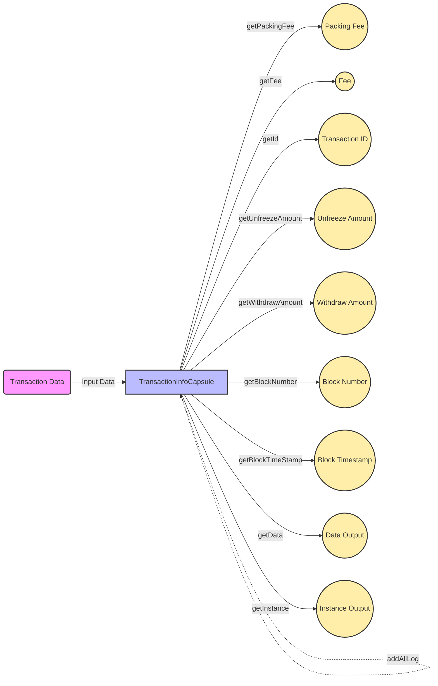

## Module: TransactionInfoCapsule.java
- **模块名称**：TransactionInfoCapsule.java

- **主要目标**：该模块的主要目的是封装和管理交易信息，包括交易费用、交易ID、解冻和提取金额等信息，以及提供对这些信息的操作方法。

- **关键函数**：
  - `TransactionInfoCapsule(TransactionInfo trxRet)`：构造函数，通过传入的TransactionInfo对象初始化。
  - `TransactionInfoCapsule(byte[] data)`：构造函数，通过解析字节数组数据来初始化。
  - `getPackingFee()`、`getFee()`、`setFee(long fee)`：获取和设置交易费用。
  - `getId()`、`setId(byte[] id)`：获取和设置交易ID。
  - `getUnfreezeAmount()`、`setUnfreezeAmount(long amount)`：获取和设置解冻金额。
  - `getWithdrawAmount()`、`setWithdrawAmount(long amount)`：获取和设置提取金额。
  - `setResult(code result)`：设置交易结果。
  - `setResMessage(String message)`：设置响应消息。
  - `addFee(long fee)`：添加额外的交易费用。
  - `getBlockNumber()`、`setBlockNumber(long num)`：获取和设置所在区块的编号。
  - `getBlockTimeStamp()`、`setBlockTimeStamp(long time)`：获取和设置区块时间戳。
  - `setContractResult(byte[] ret)`：设置合约执行结果。
  - `addAllLog(List<Log> logs)`：添加日志信息。

- **关键变量**：
  - `private TransactionInfo transactionInfo`：存储交易信息的核心变量。

- **依赖关系**：
  - 与`org.tron.protos.Protocol.TransactionInfo`有直接依赖，用于操作和管理交易信息的protobuf结构。

- **核心操作 vs. 辅助操作**：
  - 核心操作包括交易信息的获取和设置，如费用、ID、金额、结果等。
  - 辅助操作包括构造函数的重载、错误处理等。

- **操作序列**：
  - 通常首先通过构造函数初始化`TransactionInfoCapsule`对象，然后根据需要调用相应的设置或获取函数来操作交易信息。

- **性能考虑**：
  - 该模块主要涉及到对内存中数据的操作，性能影响主要取决于protobuf的解析和序列化性能。

- **可重用性**：
  - 该模块设计为可重用的组件，可以在需要管理交易信息的地方使用。

- **使用方式**：
  - 在需要处理交易信息（如查询、修改交易费用或结果等）的场景下，通过实例化并操作`TransactionInfoCapsule`对象来实现。

- **假设**：
  - 假设输入的数据格式正确，且在使用前已经通过其他机制（如交易验证）确保了数据的合法性和正确性。
## Flow Diagram [via mermaid]

