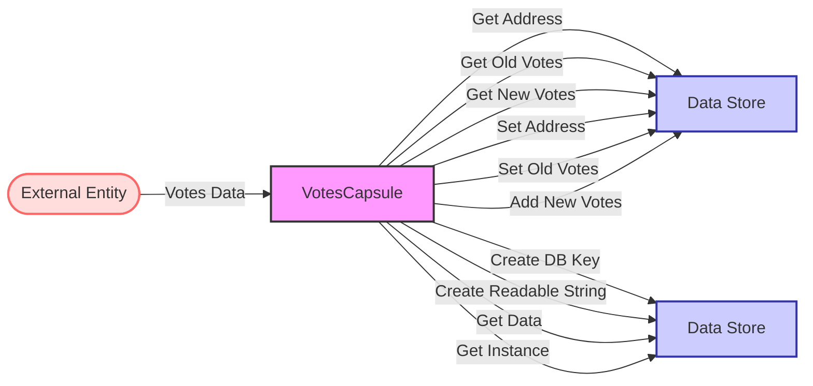

## Module: VotesCapsule.java
- **模块名称**：VotesCapsule.java

- **主要目标**：该模块的目的是管理和封装投票信息，包括投票者的地址、旧投票和新投票的列表。

- **关键功能**：
  - 构造函数：初始化VotesCapsule实例，可以通过直接传递Votes对象、字节数组或者特定的构造参数来创建。
  - getAddress()：获取投票者的地址。
  - setAddress(ByteString address)：设置投票者的地址。
  - getOldVotes() 和 getNewVotes()：分别获取旧投票和新投票的列表。
  - setOldVotes(List<Vote> oldVotes) 和 clearOldVotes()：设置和清除旧投票列表。
  - addNewVotes(ByteString voteAddress, long voteCount) 和 addAllNewVotes(List<Vote> votesToAdd)：添加新投票。
  - createDbKey() 和 createReadableString()：生成数据库键和可读字符串。
  - getData() 和 getInstance()：获取序列化的投票数据和Votes实例。

- **关键变量**：
  - private Votes votes：存储投票信息的主要变量。

- **相互依赖性**：该模块依赖于Google的protobuf库来序列化和反序列化投票信息，同时也依赖于org.tron.common.utils.ByteArray工具类来生成可读字符串。

- **核心 vs. 辅助操作**：
  - 核心操作包括管理（增加、设置、获取、清除）投票信息。
  - 辅助操作包括生成数据库键和可读字符串、序列化和反序列化投票信息。

- **操作顺序**：通常，首先通过构造函数初始化VotesCapsule实例，然后可以添加、设置或清除投票信息，最后可以获取投票信息或将其序列化。

- **性能方面**：性能考虑主要集中在有效管理内存和优化序列化/反序列化过程，以确保快速响应。

- **可重用性**：该模块设计为可重用的，可以在需要管理投票信息的不同部分和项目中使用。

- **用法**：主要用于Tron区块链系统中，管理和存储用户的投票信息，包括投票者的地址以及他们的旧投票和新投票。

- **假设**：假设所有传入的数据都是有效的，并且用户在调用方法前已经了解如何正确使用这些方法和数据结构。
## Flow Diagram [via mermaid]

