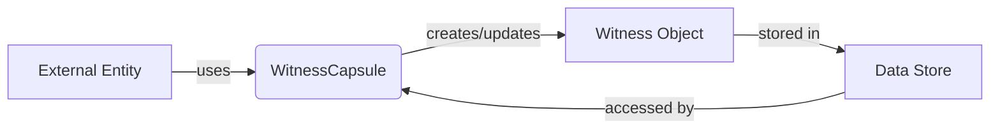

## Module: WitnessCapsule.java
- **模块名称**：WitnessCapsule.java

- **主要目标**：该模块的目的是封装见证人（Witness）对象的数据和操作，使其易于管理和使用见证人相关信息。

- **关键功能**：
  - 构造函数：提供多种构造函数来初始化见证人对象，包括通过公钥、URL、地址、投票数等信息。
  - `compareTo`：比较两个见证人的投票数，用于排序。
  - `getAddress`、`getVoteCount`等访问器方法：获取见证人的地址、投票数等信息。
  - `setPubKey`、`setVoteCount`等修改器方法：设置见证人的公钥、投票数等信息。
  - `createDbKey`、`createReadableString`：生成数据库键值和可读字符串。
  - `getData`、`getInstance`：获取见证人数据的字节表示和实例。

- **关键变量**：
  - `witness`：Witness类型的变量，存储见证人的所有相关信息。

- **交互依赖**：
  - 与其他系统组件的交互主要通过`Witness`对象的protobuf定义进行，这要求其他组件能够识别和处理protobuf格式的数据。

- **核心与辅助操作**：
  - 核心操作包括见证人信息的设置和获取。
  - 辅助操作包括生成数据库键值和可读字符串，这些操作支持数据的存储和展示。

- **操作序列**：
  - 通常，首先通过构造函数或者`set`方法初始化见证人对象，然后可以通过`get`方法获取信息，最后可能会使用`createDbKey`和`createReadableString`支持其他操作。

- **性能方面**：
  - 性能考虑主要集中在数据的序列化和反序列化上，由于使用了protobuf，这些操作通常是高效的。

- **可重用性**：
  - 该模块设计为高度可重用，可以在需要管理见证人信息的任何地方使用。

- **使用情况**：
  - 通常用于区块链系统中，特别是需要处理见证人选举、投票等逻辑的场景。

- **假设**：
  - 假设其他系统组件能够正确处理protobuf格式的数据。
  - 假设调用者了解见证人的概念和相关操作。
## Flow Diagram [via mermaid]

