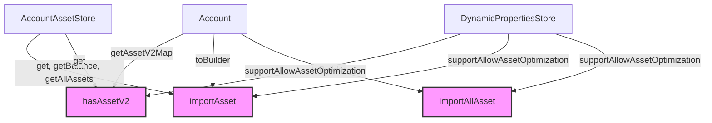

## Module: AssetUtil.java
### 模块名称
AssetUtil.java

### 主要目标
该模块的目的是提供资产管理相关的实用功能，特别是与账户的资产操作相关的功能，如检查、导入资产等。

### 关键功能
- **hasAssetV2**: 检查特定账户是否拥有指定的资产。
- **importAsset**: 将特定键的资产导入到账户中。
- **importAllAsset**: 将所有资产导入到账户中。
- **setAccountAssetStore**: 设置账户资产存储对象。
- **setDynamicPropertiesStore**: 设置动态属性存储对象。
- **isAllowAssetOptimization**: 检查是否允许资产优化。

### 关键变量
- **accountAssetStore**: 账户资产存储的引用。
- **dynamicPropertiesStore**: 动态属性存储的引用。

### 交互依赖
该模块与`AccountAssetStore`和`DynamicPropertiesStore`有直接的依赖关系，用于资产的存储和动态属性的配置。

### 核心与辅助操作
- **核心操作**：资产的检查（`hasAssetV2`）、导入（`importAsset`、`importAllAsset`）。
- **辅助操作**：设置存储对象（`setAccountAssetStore`、`setDynamicPropertiesStore`）、检查资产优化允许状态（`isAllowAssetOptimization`）。

### 操作序列
一般操作流程可能如下：
1. 通过`isAllowAssetOptimization`检查是否允许资产优化。
2. 使用`hasAssetV2`检查账户是否已有特定资产。
3. 根据需要调用`importAsset`或`importAllAsset`导入资产。

### 性能方面
- 性能考虑主要集中在资产检索和导入的效率上，特别是在与底层存储交互时。

### 可重用性
- 该模块设计为可重用的资产管理工具，可以在不同的上下文中用于账户资产的操作。

### 使用
- 在需要进行账户资产管理的地方调用该模块的方法，例如资产的检查和导入。

### 假设
- 假设`AccountAssetStore`和`DynamicPropertiesStore`已正确配置且可用。
- 假设账户和资产的数据结构已符合预期格式。

通过这种方式，`AssetUtil`模块为TRON区块链框架提供了一个专注于账户资产管理的实用工具集，使得资产的操作更加灵活和高效。
## Flow Diagram [via mermaid]

